# 软件需求规格说明书

## 1 范围

### 1.1 标识

- 项目名称：生活服务平台 / Life Service
- 项目标识号：LA-2026-SRS-CODE
- 版本：V2.0
- 文档状态：需求说明书完善稿
- 源码基线：`frontend/`、`backend/`、`scripts/` 当前工作区代码

### 1.2 系统概述

本系统是一个面向校园场景的本地生活/外卖演示平台，支持游客浏览商家与商品，消费者完成购物车、下单、支付、配送追踪、确认收货、优惠券与个人资料管理，商家维护店铺和商品并处理本店订单，骑手接单配送，管理员管理平台用户、商家、骑手和订单。

当前源码采用前后端分离架构：

- 前端：Vite + React 18 + React Router + Axios。
- 后端：Spring Boot 3.4.4 + Java 21 + MyBatis-Plus + MySQL。
- 测试：后端使用 JUnit 5、MockMvc、H2 测试库。
- 部署/联调脚本：PowerShell 与 bat 脚本。

### 1.3 参与者

| 参与者 | 说明 |
|---|---|
| 游客 | 未登录访问者，可浏览商家、商品、分类。 |
| 消费者 | 普通用户，可购物、下单、支付、查配送、确认收货、管理资料和地址、领取优惠券。 |
| 商家 | 店铺经营者，可管理店铺资料、商品、规格、库存和本店订单。 |
| 骑手 | 配送人员，可查看订单池、接单、更新配送状态和维护资料。 |
| 管理员 | 平台管理者，可查看和管理用户、商家、骑手、订单。 |
| 模拟支付服务 | 后端内部支付处理逻辑，生成支付记录和流水号。 |
| 数据库 | MySQL 或测试环境 H2，保存核心业务数据。 |

## 2 总体需求

### 2.1 系统目标

1. 支持校园外卖消费闭环：浏览、加购、下单、支付、配送、完成。
2. 支持多角色协同：消费者、商家、骑手、管理员各有独立权限和操作空间。
3. 支持营销与评价闭环：优惠券领取/锁定/使用，已完成订单评价并更新商家评分。
4. 支持演示级运营管理：管理员查询和冻结/解冻平台主体，审核商家和骑手状态。
5. 支持本地运行和自动化验证：通过初始化脚本、后端测试、E2E 脚本验证核心流程。

### 2.2 功能边界

| 范围内功能 | 范围外或预留功能 |
|---|---|
| 注册登录、JWT 鉴权、角色权限控制 | 第三方 OAuth、短信验证码真实发送 |
| 商家列表、分类筛选、商家详情、商品规格展示 | 真实地理定位和地图导航 |
| 购物车、外卖订单、支付、取消、确认完成 | 团购券完整购买与线下核销闭环 |
| 优惠券领取、订单锁券、完成核销、取消释放 | 管理员创建/编辑/删除优惠券 |
| 商家资料、商品、规格、库存、本店订单处理 | 商家钱包、提现、对账 |
| 骑手任务池、接单、配送完成、统计 | 智能派单、路线规划、在线/离线真实调度 |
| 管理员主体管理和订单查看 | 分类管理、运营位配置 |
| 消息 API、评价 API、搜索/推荐 API | 前端完整聊天页、前端评价入口当前未接入 |

## 3 用户故事与需求编号

| 需求编号 | 用户故事 | 对应用例 | 优先级 | 源码覆盖 |
|---|---|---|---|---|
| REQ01 | 作为游客/用户，我希望按角色注册或登录，以便进入对应业务工作区。 | UC01 | 高 | 前端+后端+测试 |
| REQ02 | 作为访问者，我希望浏览、筛选商家和商品，以便选择消费对象。 | UC02 | 高 | 前端+后端 |
| REQ03 | 作为用户，我希望获得推荐商家，以便快速发现优质店铺。 | UC03 | 中 | 后端 API |
| REQ04 | 作为消费者，我希望维护个人资料和收货地址，以便顺利下单。 | UC04 | 高 | 前端+后端 |
| REQ05 | 作为消费者，我希望管理购物车，以便形成可结算商品清单。 | UC05 | 高 | 前端+后端+E2E |
| REQ06 | 作为消费者，我希望领取并使用优惠券，以便降低订单金额。 | UC06 | 高 | 前端+后端+测试 |
| REQ07 | 作为消费者，我希望提交外卖订单，以便商家和骑手开始履约。 | UC07 | 高 | 前端+后端+测试 |
| REQ08 | 作为消费者，我希望支付待支付订单，以便订单进入待接单状态。 | UC08 | 高 | 前端+后端+测试 |
| REQ09 | 作为消费者，我希望取消未履约订单，以便释放库存和优惠券。 | UC09 | 高 | 前端+后端+测试 |
| REQ10 | 作为消费者，我希望查看配送并确认收货，以便完成订单。 | UC10 | 高 | 前端+后端+测试 |
| REQ11 | 作为消费者，我希望评价已完成订单，以便反馈商品和商家体验。 | UC11 | 中 | 后端 API+测试逻辑覆盖 |
| REQ12 | 作为商家，我希望注册/登录商家账号，以便进入经营后台。 | UC12 | 高 | 前端+后端 |
| REQ13 | 作为商家，我希望维护店铺资料，以便展示真实经营信息。 | UC13 | 高 | 前端+后端 |
| REQ14 | 作为商家，我希望维护商品、规格和库存，以便控制售卖内容。 | UC14 | 高 | 前端+后端 |
| REQ15 | 作为商家，我希望处理本店订单，以便推进订单履约。 | UC15 | 高 | 前端+后端+测试 |
| REQ16 | 作为骑手，我希望接单并完成配送，以便履行配送任务。 | UC16 | 高 | 前端+后端+测试 |
| REQ17 | 作为骑手，我希望维护资料，以便保证联系方式和服务区域准确。 | UC17 | 中 | 前端+后端 |
| REQ18 | 作为管理员，我希望管理用户、商家、骑手状态，以便维护平台秩序。 | UC18 | 高 | 前端+后端 |
| REQ19 | 作为管理员，我希望查看平台订单，以便监控交易情况。 | UC19 | 中 | 前端+后端+E2E |
| REQ20 | 作为登录角色，我希望查看与身份相关的看板统计，以便掌握状态。 | UC20 | 中 | 前端+后端 |
| REQ21 | 作为用户/商家/骑手，我希望围绕订单发送文字消息，以便沟通问题。 | UC21 | 低 | 后端 API |

## 4 用例图

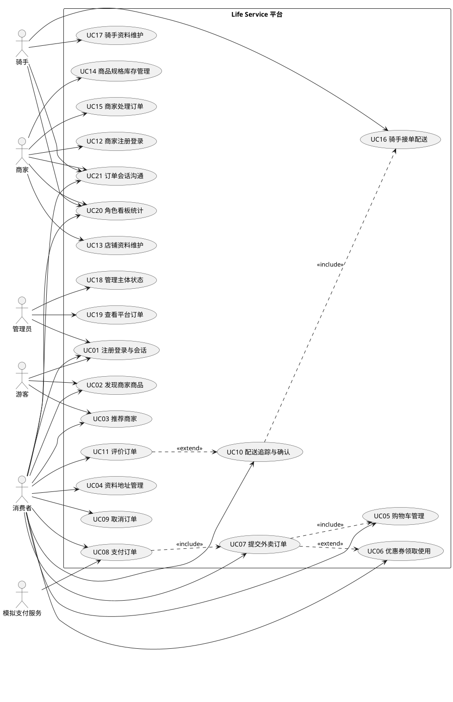
<!-- plantuml-image: 01-4-用例图 -->


## 5 概念类图

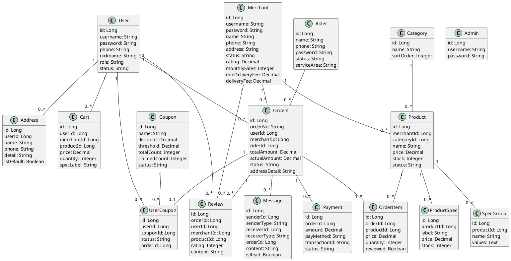
<!-- plantuml-image: 02-5-概念类图 -->


## 6 用例说明

### UC01 多角色注册、登录与会话建立

- 参与者：游客、消费者、商家、骑手、管理员。
- 触发条件：用户在登录页选择角色并提交注册或登录信息。
- 前置条件：系统已启动；登录账号存在或注册信息未被占用；管理员账号预置。
- 主成功流程：用户提交账号密码；后端按角色查表；使用 BCrypt 校验密码；生成 JWT；前端保存会话并跳转至角色默认页面。
- 备选或异常流程：用户名或手机号重复；密码错误；账号 frozen；管理员不支持注册；JWT 过期后前端清空会话。
- 可验证结果：响应包含 accessToken 和 role；受保护接口携带 Bearer token 后可访问。

### UC02 游客/用户发现商家与商品

- 参与者：游客、消费者、商家、骑手。
- 触发条件：首页加载、用户输入关键词或选择分类、打开商家详情。
- 前置条件：数据库存在 active 商家、分类和商品。
- 主成功流程：首页请求分类和商家列表；系统按状态、关键词、分类筛选；返回商家卡片和推荐商品；用户进入商家详情查看分类商品、规格、库存。
- 备选或异常流程：无匹配结果显示空状态；商家不存在返回错误；下架商品不进入可售列表。
- 可验证结果：首页展示商家列表；详情页展示商家信息和商品分类。

### UC03 基于位置/评分/销量获得推荐商家

- 参与者：访问者或前端系统。
- 触发条件：前端或外部调用推荐接口。
- 前置条件：存在 active 商家。
- 主成功流程：系统查询活跃商家；按评分、月销量、距离计算综合得分；按分值排序；返回商家和最多 3 个商品。
- 备选或异常流程：无经纬度时使用默认距离得分；无活跃商家返回空列表。
- 可验证结果：`/api/recommend` 返回按得分排序的推荐结果。

### UC04 消费者维护个人资料和收货地址

- 参与者：消费者。
- 触发条件：进入个人中心并提交资料或地址修改。
- 前置条件：消费者已登录。
- 主成功流程：读取个人资料和地址；新增、编辑、删除地址；设置默认地址时清除其他默认；更新昵称、手机号、头像。
- 备选或异常流程：手机号被占用；地址不存在或不属于当前用户；未登录或非消费者访问被拒绝。
- 可验证结果：用户资料、地址列表发生持久化变化。

### UC05 消费者管理购物车并形成结算清单

- 参与者：消费者。
- 触发条件：用户在商家详情添加商品或在购物车调整数量。
- 前置条件：消费者已登录；商品 active 且库存足够。
- 主成功流程：添加商品到购物车；若同商品和规格已存在则累加数量；用户修改数量、删除项或清空；前端按商家分组并计算小计。
- 备选或异常流程：非消费者不能加购；商品不存在/下架；数量小于等于 0 时删除；库存不足阻断。
- 可验证结果：`cart` 表和购物车页面同步展示正确数量和金额。

### UC06 消费者领取并在订单中使用优惠券

- 参与者：消费者。
- 触发条件：用户领取优惠券或结算时选择优惠券。
- 前置条件：优惠券 released、在有效期内、有剩余额度，用户未超过限领次数。
- 主成功流程：领取优惠券生成 user_coupon；下单时校验门槛并锁定优惠券；订单完成时标记 used。
- 备选或异常流程：优惠券不存在、未发布、过期、领完、超过限领、未满足门槛；订单取消时释放 locked 优惠券。
- 可验证结果：用户优惠券状态按 `unused -> locked -> used` 或 `locked -> unused` 流转。

### UC07 消费者提交外卖订单

- 参与者：消费者。
- 触发条件：结算页提交订单。
- 前置条件：消费者已登录；商家 active；商品 active；地址非空；金额达到起送价。
- 主成功流程：校验商家、商品、规格和库存；计算商品总额、配送费、优惠金额；预扣商品和规格库存；创建 orders 和 order_item；清除该商家购物车。
- 备选或异常流程：商品不属于当前商家；库存不足；规格不存在；地址为空；低于起送价；优惠券不可用。
- 可验证结果：订单状态为 `pending_payment`；订单明细生成；库存减少；购物车清理。

### UC08 消费者支付待支付订单

- 参与者：消费者、模拟支付服务。
- 触发条件：用户点击支付。
- 前置条件：存在当前消费者的 `pending_payment` 订单。
- 主成功流程：校验订单归属和状态；创建支付记录；生成交易流水；支付状态置为 SUCCESS；订单进入 `pending_accept` 并记录 paidAt。
- 备选或异常流程：订单不存在；非订单所有者；订单状态不允许支付。
- 可验证结果：`payment` 表出现 SUCCESS 记录；订单进入待接单。

### UC09 消费者取消未完成订单

- 参与者：消费者。
- 触发条件：用户在订单页取消订单。
- 前置条件：订单属于当前用户，状态为 `pending_payment` 或 `pending_accept`。
- 主成功流程：系统恢复商品和规格库存；订单状态置为 `cancelled`；释放订单锁定的优惠券。
- 备选或异常流程：订单不存在；订单已配送或已完成，不允许取消。
- 可验证结果：订单为已取消，库存恢复，优惠券重新 unused。

### UC10 消费者追踪配送并确认收货

- 参与者：消费者。
- 触发条件：用户查看配送页或在配送中订单上确认收货。
- 前置条件：订单属于当前消费者；确认收货要求状态为 `delivering`。
- 主成功流程：系统返回商家、骑手、取送地址、状态和时间线；用户确认收货；订单完成并记录 completedAt；锁定优惠券被确认使用。
- 备选或异常流程：订单不存在；非订单所有者查看配送被拒绝；非配送中不可确认收货。
- 可验证结果：订单状态 `completed`，完成时间非空，配送页显示最终状态。

### UC11 消费者评价已完成订单

- 参与者：消费者。
- 触发条件：用户提交订单商品评价。
- 前置条件：订单属于当前用户且状态为 `completed`，尚未评价。
- 主成功流程：系统校验订单和商品归属；校验评分 1-5、内容不超过 200 字；逐商品写入评价；订单明细标记 reviewed；重新计算商家评分。
- 备选或异常流程：未完成订单不可评价；重复评价；商品不属于订单；评分或内容非法。
- 可验证结果：`review` 记录生成，`order_item.reviewed=true`，商家 rating 更新。当前前端未接评价入口，后端 API 已实现。

### UC12 商家注册/启用并进入经营后台

- 参与者：商家。
- 触发条件：商家注册或登录。
- 前置条件：注册信息未重复；登录账号未被冻结。
- 主成功流程：商家提交用户名、手机号、密码、店铺名；系统创建商家并在当前源码中直接 active；登录后生成 merchant token；进入商家中心。
- 备选或异常流程：用户名或手机号重复；密码错误；账号 frozen；原文档中的待审核流程当前被简化。
- 可验证结果：商家账号可访问 `/merchant-center` 和 `/api/merchant/**`。

### UC13 商家维护店铺资料

- 参与者：商家。
- 触发条件：商家在后台提交店铺资料表单。
- 前置条件：商家已登录。
- 主成功流程：商家查看资料；更新名称、电话、地址、营业时间、分类、描述、头像、起送价、配送费、半径等；系统禁止商家修改用户名、密码、状态、评分、月销量。
- 备选或异常流程：商家不存在；未登录或非商家访问被拒绝。
- 可验证结果：`merchant` 表展示字段更新，受保护字段不被覆盖。

### UC14 商家管理商品、规格与库存

- 参与者：商家。
- 触发条件：商家新增、编辑、删除商品或维护规格。
- 前置条件：商家已登录。
- 主成功流程：商家创建商品；修改名称、分类、价格、库存、图片、状态；删除商品；新增/删除规格组和规格值。
- 备选或异常流程：商品不存在；商品不属于当前商家；规格不存在；未登录或角色错误。
- 可验证结果：商品、规格、库存数据持久化；用户侧只可购买 active 商品。

### UC15 商家处理本店订单

- 参与者：商家。
- 触发条件：商家在商家中心查看并更新订单状态。
- 前置条件：商家已登录；订单属于本店。
- 主成功流程：商家查看本店订单；将 `pending_accept` 推进为 `delivering` 或 `completed`，或将 `delivering` 推进为 `completed`；完成时记录 completedAt 并确认优惠券使用。
- 备选或异常流程：订单不存在；订单不属于本店；非法状态变更被拒绝；已完成订单不可重复操作。
- 可验证结果：订单状态按允许路径变化，消费者订单页同步变化。

### UC16 骑手接单并完成配送

- 参与者：骑手。
- 触发条件：骑手打开工作台并操作任务。
- 前置条件：骑手已登录；存在 `pending_accept` 且未分配骑手的订单。
- 主成功流程：系统返回可接单、已接单、已完成任务；骑手接单后绑定 riderId 并置为 `delivering`；骑手确认送达后订单 `completed`，完成时间写入。
- 备选或异常流程：订单已被其他骑手接单；状态不允许接单或完成；任务不属于当前骑手。
- 可验证结果：订单绑定骑手；任务列表迁移；骑手统计更新。

### UC17 骑手维护个人资料

- 参与者：骑手。
- 触发条件：骑手提交资料更新。
- 前置条件：骑手已登录。
- 主成功流程：骑手更新昵称、手机号、服务区域；系统校验手机号唯一性并保存。
- 备选或异常流程：骑手不存在；手机号被其他骑手使用；非骑手访问被拒绝。
- 可验证结果：`rider` 表资料更新。

### UC18 管理员管理用户/商家/骑手状态

- 参与者：管理员。
- 触发条件：管理员进入管理中心并执行审核、冻结或解冻。
- 前置条件：管理员已登录。
- 主成功流程：分页查看用户、商家、骑手；审核商家或骑手状态；冻结/解冻用户、商家、骑手。
- 备选或异常流程：对象不存在；非管理员访问被拒绝；状态值非法时当前服务校验较弱，应由前端或后续后端校验补充。
- 可验证结果：目标主体状态改变，冻结账号不能登录或不能被公开下单。

### UC19 管理员查看平台订单

- 参与者：管理员。
- 触发条件：管理员打开订单管理区。
- 前置条件：管理员已登录。
- 主成功流程：按页查询订单；可按订单号、状态、类型筛选；查看订单详情。
- 备选或异常流程：订单不存在；非管理员访问被拒绝。
- 可验证结果：返回订单列表或详情；管理员不修改订单。

### UC20 多角色查看运营看板

- 参与者：消费者、商家、骑手。
- 触发条件：登录角色进入对应中心。
- 前置条件：用户已登录，JWT 包含角色。
- 主成功流程：系统根据 role 计算并返回消费者、商家或骑手统计数据；前端展示订单数、收入、任务等摘要。
- 备选或异常流程：未登录被拒绝；角色不匹配时返回对应空数据。
- 可验证结果：`/api/dashboard` 返回与登录角色匹配的数据块。

### UC21 角色间订单会话沟通

- 参与者：消费者、商家、骑手。
- 触发条件：一方发送文字消息或打开会话列表。
- 前置条件：发送方已登录，知道接收方 ID 和类型，可选关联订单。
- 主成功流程：发送消息写入数据库；接收方拉取会话时返回双方消息；系统把接收方未读消息标记为已读；会话列表展示最近消息和未读数。
- 备选或异常流程：未登录；接收方缺失或内容为空当前校验较弱；跨角色授权边界需后续增强。
- 可验证结果：`message` 表新增记录，线程和未读数发生变化。当前前端未形成完整聊天页面。

## 7 每个用例的系统级流程图

### UC01 活动图

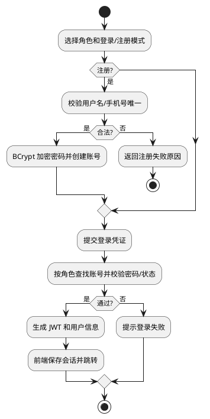
<!-- plantuml-image: 03-UC01-活动图 -->


### UC02 活动图

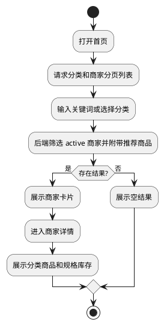
<!-- plantuml-image: 04-UC02-活动图 -->


### UC03 活动图

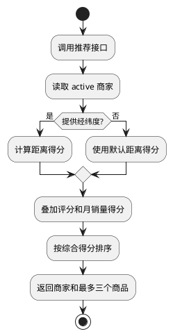
<!-- plantuml-image: 05-UC03-活动图 -->


### UC04 活动图

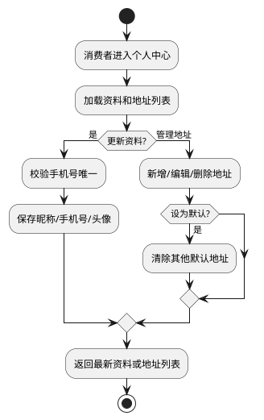
<!-- plantuml-image: 06-UC04-活动图 -->


### UC05 活动图

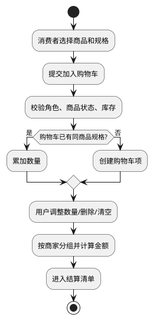
<!-- plantuml-image: 07-UC05-活动图 -->


### UC06 活动图

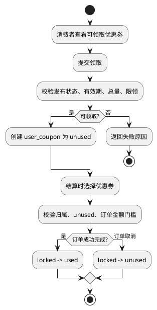
<!-- plantuml-image: 08-UC06-活动图 -->


### UC07 活动图

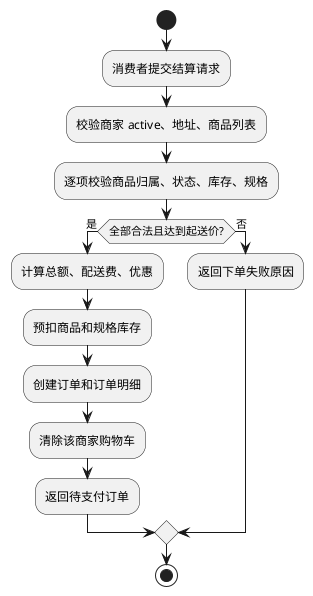
<!-- plantuml-image: 09-UC07-活动图 -->


### UC08 活动图

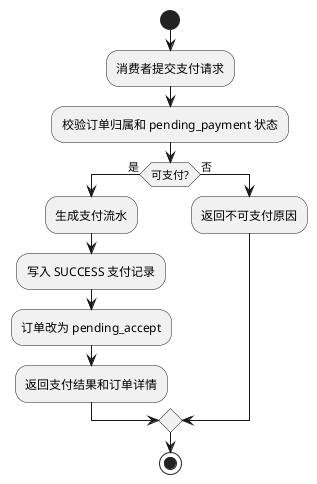
<!-- plantuml-image: 10-UC08-活动图 -->


### UC09 活动图

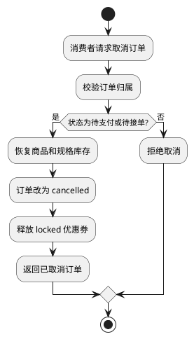
<!-- plantuml-image: 11-UC09-活动图 -->


### UC10 状态图

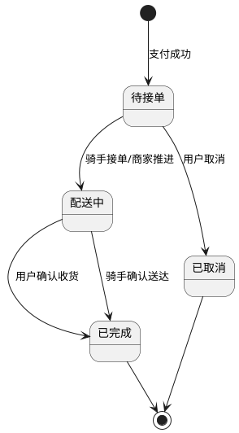
<!-- plantuml-image: 12-UC10-状态图 -->


### UC11 活动图

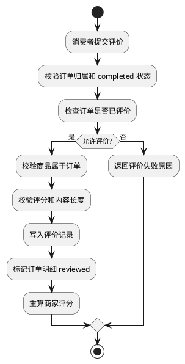
<!-- plantuml-image: 13-UC11-活动图 -->


### UC12 活动图

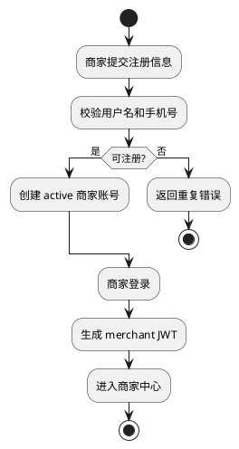
<!-- plantuml-image: 14-UC12-活动图 -->


### UC13 活动图

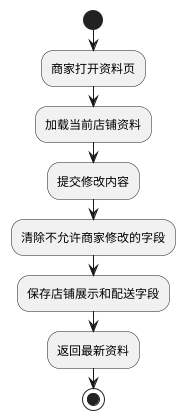
<!-- plantuml-image: 15-UC13-活动图 -->


### UC14 活动图

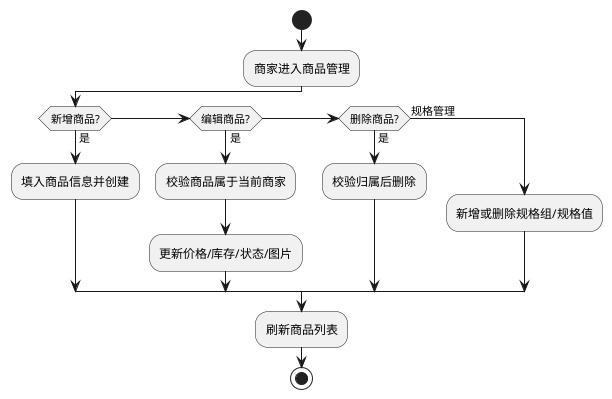
<!-- plantuml-image: 16-UC14-活动图 -->


### UC15 状态图

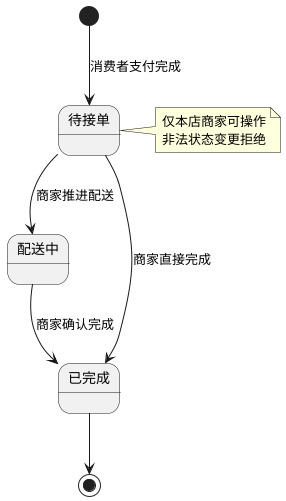
<!-- plantuml-image: 17-UC15-状态图 -->


### UC16 状态图

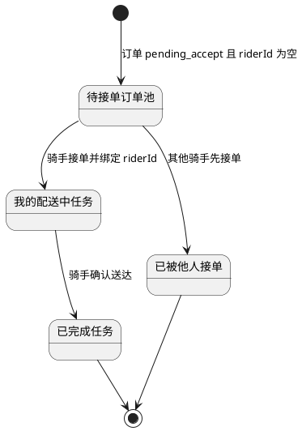
<!-- plantuml-image: 18-UC16-状态图 -->


### UC17 活动图

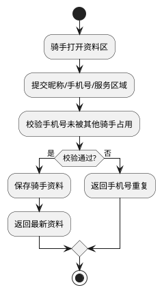
<!-- plantuml-image: 19-UC17-活动图 -->


### UC18 活动图

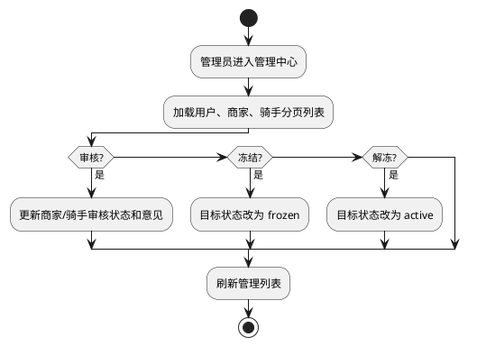
<!-- plantuml-image: 20-UC18-活动图 -->


### UC19 活动图

```plantuml
@startuml
start
:管理员打开订单管理;
:输入订单号/状态/类型筛选;
:系统分页查询 orders;
if (查看详情?) then (是)
  :按订单 ID 读取详情;
endif
:返回列表或详情;
stop
@enduml
```
<!-- plantuml-image: 21-UC19-活动图 -->


### UC20 活动图

```plantuml
@startuml
start
:登录用户进入角色中心;
:携带 JWT 请求 dashboard;
:后端读取 role;
if (consumer?) then (是)
  :统计消费者订单数据;
elseif (merchant?) then (是)
  :统计本店订单和收入;
elseif (rider?) then (是)
  :统计骑手任务和收入;
endif
:返回对应看板数据;
stop
@enduml
```
<!-- plantuml-image: 22-UC20-活动图 -->


### UC21 活动图

```plantuml
@startuml
start
:登录角色发送文字消息;
:系统记录发送方、接收方、订单和内容;
:接收方拉取会话;
:查询双方消息并按时间排序;
:将接收方未读消息标记为已读;
:返回消息列表、线程和未读数;
stop
@enduml
```
<!-- plantuml-image: 23-UC21-活动图 -->


## 8 主要状态与规则

### 8.1 订单状态

| 状态码 | 展示文本 | 含义 | 可进入方式 |
|---|---|---|---|
| pending_payment | 待支付 | 订单已创建，尚未支付 | 消费者提交订单 |
| pending_accept | 待取餐/待接单 | 支付成功，等待商家/骑手处理 | 消费者支付成功 |
| delivering | 配送中 | 订单正在配送 | 骑手接单或商家推进 |
| completed | 已完成 | 订单履约结束 | 用户、骑手或商家完成 |
| cancelled | 已取消 | 订单取消 | 用户在允许状态取消 |
| pending_use | 待使用 | 预留团购状态 | 当前主流程未使用 |

### 8.2 优惠券状态

| 状态码 | 含义 | 触发 |
|---|---|---|
| unused | 已领取未使用 | 领取成功或订单取消释放 |
| locked | 已锁定 | 下单成功且使用优惠券 |
| used | 已使用 | 订单完成 |

### 8.3 角色权限规则

- `/api/user/**`、`/api/checkout`、`/api/orders/**`、`/api/coupons/**`、`/api/delivery/**`、`/api/payments/**` 仅消费者访问。
- `/api/merchant/**` 仅商家访问。
- `/api/rider/**` 仅骑手访问。
- `/api/admin/**` 仅管理员访问。
- `/api/auth/**`、`/api/health`、`/api/merchants/**`、`/api/categories`、`/api/products/**`、`/api/search`、`/api/recommend` 放行或公共访问。

## 9 接口与实现追踪

| 用例 | 前端入口 | 后端入口 | 关键服务 | 测试/脚本 |
|---|---|---|---|---|
| UC01 | `frontend/src/pages/Login.jsx`、`frontend/src/utils/ApiProvider.jsx` | `AuthController` | `AuthService`、`JwtUtil`、`JwtAuthInterceptor` | `DemoApplicationTests.login()` |
| UC02 | `Home.jsx`、`MerchantDetail.jsx` | `MerchantController` | `MerchantService` | 演示验证 |
| UC03 | 当前前端未接 | `RecommendController` | `RecommendService` | 待补充 |
| UC04 | `Profile.jsx` | `UserController` | `UserService` | 待补充 |
| UC05 | `MerchantDetail.jsx`、`Cart.jsx` | `UserController` | `UserService` | `e2e-backend-test.ps1` |
| UC06 | `Coupons.jsx`、`Checkout.jsx` | `CouponController` | `CouponService`、`OrderService` | `claimCouponRejectsEmptyInventoryAndNullLimit`、`releaseCouponClearsOrderBinding` |
| UC07 | `Checkout.jsx` | `OrderController` | `OrderService` | `fullConsumerRiderFlowWorksEndToEnd`、`checkoutReservesInventoryAndCancelRestoresIt` |
| UC08 | `Checkout.jsx`、`Orders.jsx` | `PaymentController` | `PaymentService` | `fullConsumerRiderFlowWorksEndToEnd`、E2E 脚本 |
| UC09 | `Orders.jsx` | `OrderController` | `OrderService` | `checkoutReservesInventoryAndCancelRestoresIt` |
| UC10 | `Delivery.jsx`、`Orders.jsx` | `DeliveryController`、`OrderController` | `DeliveryService`、`OrderService` | `deliveryInfoRequiresOrderOwner`、E2E 脚本 |
| UC11 | 当前前端未接 | `ReviewController` | `ReviewService` | 评价相关规则需补接口测试 |
| UC12 | `Login.jsx` | `AuthController` | `AuthService` | 登录辅助测试 |
| UC13 | `MerchantConsole.jsx` | `MerchantController` | `MerchantService` | 待补充 |
| UC14 | `MerchantConsole.jsx` | `MerchantController` | `MerchantService` | 待补充 |
| UC15 | `MerchantConsole.jsx` | `MerchantOrderController` | `OrderService` | `merchantApiAcceptsChineseStatusValue` |
| UC16 | `RiderConsole.jsx` | `RiderController` | `RiderService` | `riderCompletionMarksLockedCouponAsUsed`、E2E 脚本 |
| UC17 | `RiderConsole.jsx` | `RiderController` | `RiderService` | 待补充 |
| UC18 | `AdminConsole.jsx` | `AdminController` | `AdminService` | E2E 脚本管理员用户查询 |
| UC19 | `AdminConsole.jsx` | `AdminController` | `AdminService` | E2E 脚本 |
| UC20 | `MerchantConsole.jsx`、`RiderConsole.jsx` | `DashboardController` | `DashboardService` | 待补充 |
| UC21 | 当前前端未接 | `MessageController` | `MessageService` | 待补充 |

### 9.1 代表性追踪：订单闭环

- 需求链：REQ05、REQ07、REQ08、REQ10、REQ16。
- 用例链：UC05、UC07、UC08、UC10、UC16。
- 系统图：UC05、UC07、UC08 活动图；UC10、UC16 状态图。
- 组件：`Checkout.jsx`、`Orders.jsx`、`RiderConsole.jsx`、`Delivery.jsx`；`OrderController`、`PaymentController`、`RiderController`、`DeliveryController`。
- 对象：`Orders`、`OrderItem`、`Product`、`ProductSpec`、`Payment`、`UserCoupon`。
- 测试：`fullConsumerRiderFlowWorksEndToEnd`、`checkoutReservesInventoryAndCancelRestoresIt`、`e2e-backend-test.ps1`。

### 9.2 代表性追踪：优惠券生命周期

- 需求链：REQ06。
- 用例链：UC06，并扩展 UC07、UC09、UC10、UC15、UC16。
- 系统图：UC06 活动图。
- 组件：`Coupons.jsx`、`Checkout.jsx`；`CouponController`、`OrderController`。
- 对象：`Coupon`、`UserCoupon`、`Orders`。
- 测试：`claimCouponRejectsEmptyInventoryAndNullLimit`、`releaseCouponClearsOrderBinding`、`riderCompletionMarksLockedCouponAsUsed`、`fullConsumerRiderFlowWorksEndToEnd`。

### 9.3 代表性追踪：商家订单处理

- 需求链：REQ15。
- 用例链：UC15。
- 系统图：UC15 状态图。
- 组件：`MerchantConsole.jsx`；`MerchantOrderController`、`OrderService`。
- 对象：`Merchant`、`Orders`、`OrderItem`、`UserCoupon`。
- 测试：`merchantApiAcceptsChineseStatusValue`。

## 10 合格性规定

| 用例 | 合格性方法 | 通过标准 |
|---|---|---|
| UC01 | MockMvc/API 测试与前端演示 | 正确返回 token、role，错误凭证失败。 |
| UC02 | 前端演示 | 首页和详情页可展示真实后端商家商品。 |
| UC03 | API 测试 | 推荐结果按综合分排序，无经纬度可降级。 |
| UC04 | 前端演示/API 测试 | 资料和地址 CRUD 正确且不可越权。 |
| UC05 | E2E/API 测试 | 加购、改量、删除、清空结果正确。 |
| UC06 | 单元/集成测试 | 限领、库存、锁定、释放、使用状态正确。 |
| UC07 | 集成测试 | 下单校验、金额、库存、明细、购物车清理正确。 |
| UC08 | 集成/E2E 测试 | 支付记录 SUCCESS，订单进入待接单。 |
| UC09 | 集成测试 | 取消订单恢复库存并释放优惠券。 |
| UC10 | 集成/E2E 测试 | 仅订单所有者可查配送，配送中可确认完成。 |
| UC11 | API 测试 | 已完成未评价订单可评价，重复和非法评分被拒绝。 |
| UC12 | 前端演示/API 测试 | 商家注册登录后进入商家中心。 |
| UC13 | 前端演示 | 店铺资料更新后持久化。 |
| UC14 | 前端演示/API 测试 | 商品新增、编辑、删除和库存更新正确。 |
| UC15 | 集成测试 | 本店订单可按允许状态流转，非法变更失败。 |
| UC16 | 集成/E2E 测试 | 骑手接单绑定 riderId，完成后订单完成。 |
| UC17 | API 测试 | 骑手资料更新，手机号唯一约束生效。 |
| UC18 | 前端演示/API 测试 | 管理员可冻结/解冻/审核主体状态。 |
| UC19 | E2E/API 测试 | 管理员可分页查看订单。 |
| UC20 | API 测试 | 不同角色返回不同看板数据。 |
| UC21 | API 测试 | 消息发送、线程、未读数和已读标记正确。 |

## 11 运行环境与约束

| 项 | 当前源码要求 |
|---|---|
| Java | Java 21 |
| 后端框架 | Spring Boot 3.4.4 |
| 数据库 | MySQL 8，测试环境 H2 |
| 前端 | Node.js 18+、Vite、React 18 |
| 后端端口 | 8081 |
| 前端端口 | 5173 |
| API 前缀 | `/api` |
| 鉴权 | JWT Bearer Token |
| 支付 | 内部模拟支付，当前实现成功支付 |

## 12 尚未实现或需后续补强的问题

1. 原需求中的 Vue、Spring Cloud、Gateway、Nacos、Redis 缓存并非当前源码形态，应在课程文档中说明为设计演进方向或移除。
2. 团购券核销、钱包提现、真实地图导航、管理员优惠券 CRUD、分类管理、超时自动取消当前未形成完整实现闭环。
3. 评价、消息、搜索、推荐后端 API 已存在，但当前前端页面入口不完整，应补前端页面或在验收中按 API 能力说明。
4. 管理员审核状态值、消息接收方合法性等后端校验还可加强。
5. 配置中存在默认数据库密码和 JWT secret 明文，正式交付应改为环境变量并更新文档。

## 13 附录：状态码与示例账号

### 13.1 演示账号

| 角色 | 账号 | 密码 |
|---|---|---|
| 消费者 | demo | 123456 |
| 商家 | merchant1 | 123456 |
| 骑手 | rider01 | 123456 |
| 管理员 | gl1 | gl1gl1gl1 |

### 13.2 关键脚本

| 脚本 | 用途 |
|---|---|
| `scripts/init-db.ps1` | 初始化 MySQL 数据库和演示数据。 |
| `scripts/seed-showcase-merchants.ps1` | 通过 API 补充展示商家和商品。 |
| `scripts/e2e-backend-test.ps1` | 验证登录、加购、下单、支付、骑手接单、配送、完成、管理员查询。 |
| `scripts/start.bat` | 尝试启动 MySQL、初始化库、构建/启动后端和前端。 |

