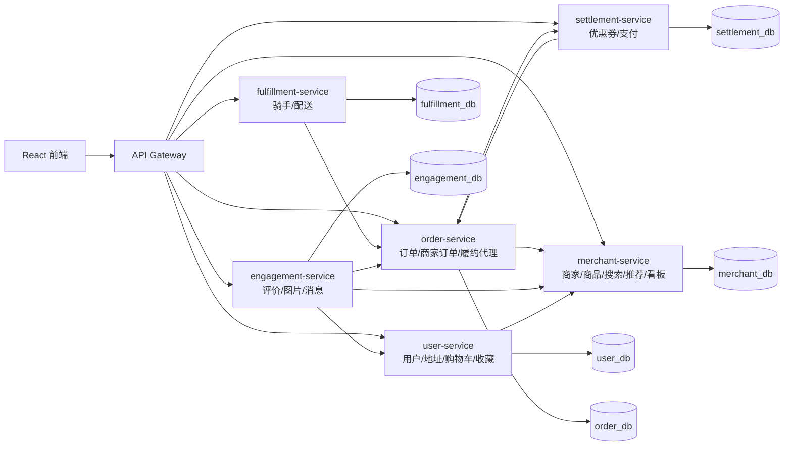

# 服务划分图

## 1. 图源文件

模型源文件：`docs/delivery/models/service-architecture.mmd`

## 2. Mermaid 图

```mermaid
flowchart LR
  FE[React 前端] --> GW[API Gateway]
  GW --> US[user-service\n用户/地址/购物车/收藏]
  GW --> MS[merchant-service\n商家/商品/搜索/推荐/看板]
  GW --> OS[order-service\n订单/商家订单/履约代理]
  GW --> SS[settlement-service\n优惠券/支付]
  GW --> FS[fulfillment-service\n骑手/配送]
  GW --> ES[engagement-service\n评价/图片/消息]
  US --> UDB[(user_db)]
  MS --> MDB[(merchant_db)]
  OS --> ODB[(order_db)]
  SS --> SDB[(settlement_db)]
  FS --> FDB[(fulfillment_db)]
  ES --> EDB[(engagement_db)]
  OS --> MS
  OS --> SS
  SS --> OS
  FS --> OS
  ES --> OS
  ES --> US
  ES --> MS
  US --> MS
```

## 3. 汇报说明

该图用于说明当前微服务拆分后的运行态：前端不直接访问业务服务，所有请求经 Gateway 路由；每个业务服务拥有自己的数据库 schema；跨服务调用通过内部接口完成。
