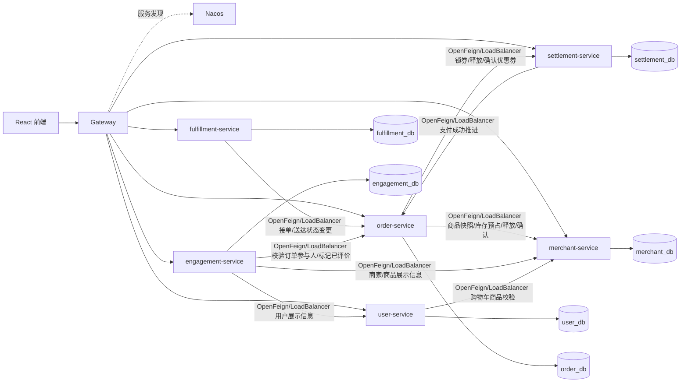

# 负责人 A 微服务边界与主链路改造计划

## 1. 工作范围

负责人 A 负责微服务拆分中的核心边界和主链路落地，重点不是按用例数量机械拆分，而是保证服务职责、数据库所有权和跨服务调用规则一致。

负责人 A 的主要职责：

| 工作项 | 本阶段交付 |
| --- | --- |
| 架构与边界 | 维护服务划分、数据归属和跨服务访问规则，避免服务互相直接访问数据表 |
| 数据库拆分 | 按服务 Owner 拆出多 schema 初始化脚本，给后续独立数据源和账号授权做准备 |
| 服务拆分 | 优先负责 `merchant-service`、`order-service`、`settlement-service` 主交易链路 |
| 接口联调 | 定义内部接口 DTO、错误码、幂等键、超时、重试和补偿策略 |
| 部署 | 推动 docker-compose、Kubernetes、CI/CD 支持多服务独立构建和部署 |
| 测试 | 补后端单元/集成测试，保证每个服务可以独立运行 `test` |

## 2. 改造前后代码版本

| 版本 | 代码形态 | 说明 |
| --- | --- | --- |
| V1 单体基线 | 当前 `main` 分支，`backend/` 一个 Spring Boot 应用 | 所有业务包共享一个进程、一个数据源、一个 `life_assistant` 数据库 |
| V2 微服务目标 | 目标目录为 `services/*-service` | 每个业务服务独立构建、测试、部署，只连接自己的 database/schema |

建议在正式代码拆分前打 tag：

```text
monolith-baseline
```

后续微服务改造在新分支进行，例如：

```text
microservices/owner-a-foundation
microservices/merchant-service
microservices/order-settlement
```

## 3. 目标业务服务划分

本方案采用 6 个业务微服务。Gateway、Nacos、前端和数据库均不计入业务微服务数量。

| 服务 | 负责业务 | 当前可迁移包 | 拆分理由 |
| --- | --- | --- | --- |
| `user-service` | 消费者、管理员账号，用户资料，地址，购物车，收藏 | `auth` 的用户/管理员部分、`user` | 用户资料和购物车是用户侧高频状态，购物车保存商品快照，但不拥有商品事实 |
| `merchant-service` | 商家账号，门店档案，分类，商品，规格，库存，搜索，推荐 | `auth` 的商家部分、`merchant`、`search`、`recommend` | 商家商品是下单前事实源，库存和商品状态必须由该服务统一管理 |
| `order-service` | 下单，订单状态机，订单明细快照，团购券码，商家订单视图 | `order` | 订单是交易聚合根，负责状态推进和订单快照，不直接拥有商品、优惠券、支付、骑手资料 |
| `settlement-service` | 优惠券模板，用户券，锁券/释放/核销，支付流水 | `coupon`、`payment` | 支付和优惠券需要独立幂等、一致性和补偿逻辑 |
| `fulfillment-service` | 骑手账号，骑手资料，接单，配送任务视图，送达 | `auth` 的骑手部分、`rider`、`delivery` | 骑手和履约状态独立于订单存储，但通过订单服务推进订单状态 |
| `engagement-service` | 评价，评价图片，订单会话，消息线程，未读数 | `review`、`message` | 互动内容不应阻塞交易主链路，评分和已评价状态通过事件/补偿同步 |

## 4. 服务划分图



## 5. 数据表归属表

| 当前表 | Owner 服务 | 目标 schema | 其他服务访问方式 |
| --- | --- | --- | --- |
| `admin` | `user-service` | `user_db` | 其他服务不直接访问；Gateway 校验 token 后透传身份 |
| `user` | `user-service` | `user_db` | 内部用户快照接口 |
| `address` | `user-service` | `user_db` | 订单服务调用地址快照接口，下单后保存地址快照 |
| `cart` | `user-service` | `user_db` | 下单成功后通过事件或内部接口清理购物车 |
| `user_favorite_merchant` | `user-service` | `user_db` | 商家状态变化通过事件刷新收藏展示 |
| `merchant` | `merchant-service` | `merchant_db` | 内部商家快照接口 |
| `category` | `merchant-service` | `merchant_db` | 公开分类接口 |
| `product` | `merchant-service` | `merchant_db` | 商品报价、详情、库存接口 |
| `spec_group` | `merchant-service` | `merchant_db` | 商品详情或报价接口 |
| `product_spec` | `merchant-service` | `merchant_db` | 商品报价和库存预占接口 |
| `orders` | `order-service` | `order_db` | 订单内部状态/权限/金额校验接口 |
| `order_item` | `order-service` | `order_db` | 订单详情接口或评价资格校验接口 |
| `group_coupon` | `order-service` | `order_db` | 订单详情接口 |
| `coupon` | `settlement-service` | `settlement_db` | 优惠券公开接口和内部锁券接口 |
| `user_coupon` | `settlement-service` | `settlement_db` | 锁券、释放、核销接口 |
| `payment` | `settlement-service` | `settlement_db` | 支付查询接口和支付成功事件 |
| `rider` | `fulfillment-service` | `fulfillment_db` | 骑手快照和状态校验接口 |
| `review` | `engagement-service` | `engagement_db` | 评价公开查询接口；评分投影通过事件更新 |
| `message` | `engagement-service` | `engagement_db` | 消息公开接口；发送前调各 Owner 校验参与人 |

## 6. 负责人 A 主链路内部接口草案

### 6.1 merchant-service

| 接口 | 方法 | 调用方 | 用途 | 失败处理 |
| --- | --- | --- | --- | --- |
| `/internal/merchants/{merchantId}` | `GET` | `order-service`、`fulfillment-service`、`engagement-service` | 获取商家状态、名称、地址、配送费、起送价等快照 | 不可用时调用方终止当前写操作；查询场景可降级展示缺失字段 |
| `/internal/products/quote` | `POST` | `user-service`、`order-service` | 按商品 ID、规格、数量返回价格、库存、商品状态、所属商家 | 商品无效或库存不足返回 `available=false` 和明细原因；服务不可用返回可重试错误 |
| `/internal/inventory/reservations` | `POST` | `order-service` | 使用 `orderNo` 幂等键预占库存 | 预占失败则订单不创建 |
| `/internal/inventory/reservations/{reservationId}` | `DELETE` | `order-service` | 订单创建失败或取消时释放库存 | 接口必须幂等；失败进入补偿重试 |
| `/internal/inventory/reservations/{reservationId}/commit` | `POST` | `order-service` | 订单支付或商家接单后确认扣减库存 | 接口必须幂等；失败由调用方写入本地补偿记录后重试 |

DTO 草案：

```json
{
  "requestId": "NO202608270001",
  "merchantId": 20001,
  "items": [
    {
      "productId": 30001,
      "specLabel": "Large",
      "quantity": 1
    }
  ]
}
```

### 6.2 order-service

| 接口 | 方法 | 调用方 | 用途 | 失败处理 |
| --- | --- | --- | --- | --- |
| `/internal/orders/{orderId}` | `GET` | `settlement-service`、`fulfillment-service`、`engagement-service` | 查询订单状态、金额、参与人、商品明细快照 | 不可用时调用方返回可重试错误 |
| `/internal/orders/{orderId}/mark-paid` | `POST` | `settlement-service` | 支付成功后幂等推进为待接单 | 按 `transactionId` 幂等处理；失败由支付服务写入本地补偿记录后重试 |
| `/internal/orders/{orderId}/assign-rider` | `POST` | `fulfillment-service` | 骑手接单，订单服务保证并发安全 | 冲突返回 409，骑手端刷新任务 |
| `/internal/orders/{orderId}/delivered` | `POST` | `fulfillment-service` | 骑手送达后推进订单状态 | 状态不匹配返回业务错误，可重试 |
| `/internal/orders/{orderId}/reviewed-items` | `POST` | `engagement-service` | 评价成功后标记明细已评价 | 失败由互动服务写入本地补偿记录后重试 |

### 6.3 settlement-service

| 接口/事件 | 类型 | 调用方/订阅方 | 用途 | 失败处理 |
| --- | --- | --- | --- | --- |
| `/internal/coupon-locks` | `POST` | `order-service` | 下单时锁定用户券并返回优惠金额 | 锁券失败则订单服务释放库存并终止下单 |
| `/internal/coupon-locks/{orderId}/release` | `POST` | `order-service` | 取消订单或下单失败时释放用户券 | 幂等；失败进入补偿重试 |
| `/internal/coupon-locks/{orderId}/confirm` | `POST` | `order-service` | 订单完成后确认核销优惠券 | 幂等；失败进入补偿重试 |
| `/internal/orders/{orderId}/mark-paid` | OpenFeign 调用 | `order-service` | 支付成功后推进订单为待接单 | 支付服务本地保留成功流水和补偿状态，订单服务按 `transactionId` 幂等 |

## 7. 主链路跨服务流程

### 7.1 下单结算

1. `order-service` 接收下单请求。
2. 调 `user-service` 校验用户状态和地址，复制地址快照。
3. 调 `merchant-service` 获取商家和商品报价，校验 active、起送价、规格、价格和库存。
4. 调 `merchant-service` 创建库存预占，幂等键使用 `orderNo`。
5. 调 `settlement-service` 锁定优惠券。
6. `order-service` 本地事务写入 `orders`、`order_item`、`group_coupon`。
7. 调 `user-service` 清理对应商家购物车；失败时订单仍成立，订单服务记录补偿任务。

失败处理：

| 失败点 | 处理 |
| --- | --- |
| 用户/地址校验失败 | 不创建订单，直接返回错误 |
| 商品报价或库存不足 | 不创建订单，返回商品状态或库存错误 |
| 库存预占成功但锁券失败 | 调库存释放接口，释放失败进入补偿重试 |
| 锁券成功但订单写入失败 | 调库存释放和优惠券释放，失败进入补偿重试 |
| 购物车清理失败 | 不影响订单，订单服务记录补偿任务并重试清理接口 |

### 7.2 支付

1. `settlement-service` 校验订单状态和金额。
2. 写入 `payment`，用 `orderId + payMethod + transactionId` 保证幂等。
3. 调用 `order-service /mark-paid`。
4. `order-service` 幂等推进 `pending_payment -> pending_accept`。

失败处理：

| 失败点 | 处理 |
| --- | --- |
| 订单金额或状态不匹配 | 拒绝支付，不写成功流水 |
| 支付成功但订单接口失败 | 支付流水保持成功，结算服务记录补偿任务并持续重试 |
| 重复支付回调 | 根据幂等键返回已有支付结果 |

### 7.3 取消与完成

取消：

1. `order-service` 幂等更新订单为 `cancelled`。
2. 调 `merchant-service` 释放库存预占。
3. 调 `settlement-service` 释放优惠券。
4. 调用失败时订单服务记录补偿任务并重试。

完成：

1. `fulfillment-service` 或用户确认送达。
2. `order-service` 推进订单为 `completed`。
3. 调 `settlement-service` 确认优惠券核销。
4. 调 `merchant-service` 更新销量投影。
5. 调用失败时订单服务记录补偿任务并重试。

## 8. 数据库拆分落地

多 schema 初始化脚本草案位于：

```text
db/microservices/init-microservice-schemas.sql
```

落地约束：

1. 每个服务使用独立数据库账号，只授予本服务 schema 的读写权限。
2. 跨 schema 不建外键，不跨库联表查询。
3. 订单、购物车、支付、评价等表只保存其他服务的 ID 和必要快照。
4. 高频展示字段通过 OpenFeign 同步接口获取，或由本服务维护必要快照；失败补偿使用本服务数据库中的补偿记录。

## 8.1 公共包与技术栈约束

公共包位于：

```text
services/common-lib
```

当前公共包提供统一响应、分页响应、业务异常、全局异常处理、基础实体、MyBatis-Plus 配置、自动填充、健康检查、Long ID 序列化、服务名和内部请求头常量。详细说明见：

```text
docs/microservices/common-lib-guide.md
```

微服务架构技术栈限定为：

```text
Gateway
Nacos
OpenFeign
LoadBalancer
```

当前阶段不引入额外消息队列、注册中心或配置中心技术。跨服务调用统一按 OpenFeign + LoadBalancer 规划，服务注册发现按 Nacos 规划，统一前端入口按 Gateway 规划。

本分支已新增 `order-service` 骨架：

1. 使用 `services/common-lib` 作为公共依赖。
2. 独立拥有 `orders`、`order_item`、`group_coupon` 三张表。
3. 提供 `GET /internal/orders/{orderId}` 内部订单快照接口。
4. 提供 `POST /internal/orders/{orderId}/mark-paid` 支付成功推进接口。
5. 通过 `MerchantProductClient` 预留 OpenFeign 调用 `merchant-service /internal/products/quote` 的模板。
6. 暂不开放用户端订单接口，也不替换单体 `backend/` 中的下单流程。

本分支已新增 `settlement-service` 骨架：

1. 使用 `services/common-lib` 作为公共依赖。
2. 独立拥有 `coupon`、`user_coupon`、`payment` 三张表。
3. 提供 `POST /internal/coupon-locks` 优惠券锁定接口。
4. 提供 `POST /internal/coupon-locks/{orderId}/release` 优惠券释放接口。
5. 提供 `POST /internal/coupon-locks/{orderId}/confirm` 优惠券核销接口。
6. 提供 `POST /internal/payments/mock-success` 模拟支付成功接口，并通过 OpenFeign 调用 `order-service /internal/orders/{orderId}/mark-paid`。
7. 暂不开放用户端领券/支付页面接口，也不替换单体 `backend/` 中的支付和优惠券流程。

建议账号：

| 服务 | schema | 数据库账号 |
| --- | --- | --- |
| `user-service` | `user_db` | `user_svc` |
| `merchant-service` | `merchant_db` | `merchant_svc` |
| `order-service` | `order_db` | `order_svc` |
| `settlement-service` | `settlement_db` | `settlement_svc` |
| `fulfillment-service` | `fulfillment_db` | `fulfillment_svc` |
| `engagement-service` | `engagement_db` | `engagement_svc` |

## 9. 第一轮实际落地状态

负责人 A 第一轮不要同时拆 6 个服务。本分支先做 `merchant-service` 小闭环：

1. 已新建 `services/merchant-service` 独立 Gradle 工程。
2. 已迁移公开商家列表、商家详情、商品详情、分类、搜索、推荐能力。
3. 已配置默认连接 `merchant_db`，测试环境只初始化 `merchant`、`category`、`product`、`spec_group`、`product_spec`。
4. 已实现 `/internal/products/quote` 内部商品报价接口，返回商品归属、状态、规格加价、库存和金额。
5. 暂未实现库存预占/释放/确认接口；该能力需要 `inventory_reservation` 表和本地补偿状态表后再落地。
6. 单体 `backend/` 保持不变，当前仍作为 V1 基线运行。

完成标准：

| 验收项 | 标准 |
| --- | --- |
| 服务边界 | 商家商品数据只由 `merchant-service` 管理 |
| 独立构建 | `services/merchant-service` 可独立编译、测试和打包 |
| 数据隔离 | `merchant-service` 只连接 `merchant_db` |
| 内部接口 | 商品报价已实现；库存预占接口保留为下一阶段契约 |
| 单体兼容 | 当前单体版本仍保留，可作为 V1 基线运行 |

## 10. 第一轮服务目录

```text
services/merchant-service
```

当前公开接口：

| 接口 | 说明 |
| --- | --- |
| `GET /api/merchants` | active 商家分页列表，支持 keyword/category |
| `GET /api/merchants/{id}` | active 商家详情和商品分类 |
| `GET /api/products/{id}` | active 商品详情，并校验所属商家 active |
| `GET /api/categories` | 商品分类 |
| `GET /api/search` | 商家名、标签、商品名搜索，只返回 active 商家 |
| `GET /api/recommend` | 按评分、销量、距离权重推荐 active 商家 |
| `POST /internal/products/quote` | 面向订单/用户服务的商品报价和库存校验 |

## 11. 第二轮服务目录

```text
services/order-service
```

当前内部接口：

| 接口 | 说明 |
| --- | --- |
| `GET /internal/orders/{orderId}` | 返回订单状态、金额、参与人 ID、地址快照和订单明细快照 |
| `POST /internal/orders/{orderId}/mark-paid` | 结算服务支付成功后推进 `pending_payment -> pending_accept`，校验支付金额并保持已支付订单幂等 |

当前 OpenFeign 调用模板：

| Client | 目标服务 | 目标接口 | 用途 |
| --- | --- | --- | --- |
| `MerchantProductClient` | `merchant-service` | `POST /internal/products/quote` | 下单前获取商品价格、规格、库存和可购买状态 |

## 12. 第三轮服务目录

```text
services/settlement-service
```

当前内部接口：

| 接口 | 说明 |
| --- | --- |
| `POST /internal/coupon-locks` | 下单时锁定用户优惠券，校验券状态、有效期和门槛 |
| `POST /internal/coupon-locks/{orderId}/release` | 订单取消或下单失败时释放已锁定优惠券 |
| `POST /internal/coupon-locks/{orderId}/confirm` | 订单完成时将锁定优惠券核销为 used |
| `POST /internal/payments/mock-success` | 写入模拟支付成功流水，并调用订单服务推进订单状态 |

当前 OpenFeign 调用模板：

| Client | 目标服务 | 目标接口 | 用途 |
| --- | --- | --- | --- |
| `OrderClient` | `order-service` | `POST /internal/orders/{orderId}/mark-paid` | 支付成功后推进订单为待接单 |

至此，当前分支已经形成 3 个业务微服务骨架：`merchant-service`、`order-service`、`settlement-service`。每个服务都可以独立构建，且只管理自己的业务表。
