# 软件详细设计说明书（源码一致版）

## 1 引言

### 1.1 编写目的

本文档依据当前源码对生活服务平台进行详细设计说明，描述系统实际采用的技术结构、类与模块关系、关键对象协作流程、接口实现和测试追踪。原始详细设计说明书中与源码不符的内容，例如 Vue3、Spring Cloud Gateway、Nacos、Redis 缓存、钱包提现、真实地图导航、团购核销完整闭环等，均不作为当前实现依据。

### 1.2 源码基线

- 前端目录：`frontend/`
- 后端目录：`backend/`
- 脚本目录：`scripts/`
- 前端技术：Vite、React 18、React Router、Axios。
- 后端技术：Java 21、Spring Boot 3.4.4、MyBatis-Plus、MySQL、H2 测试库、JWT、BCrypt。
- 运行端口：后端 `8081`，前端 `5173`。

### 1.3 设计约束

1. 当前后端为 Spring Boot 单体应用，按包进行业务模块划分，不是 Spring Cloud 微服务。
2. Redis 依赖存在于构建文件中，但应用启动类排除了 Redis 自动配置，当前业务不依赖 Redis。
3. 购物车、订单、优惠券、消息、评价等核心数据均由数据库表持久化。
4. 支付为内部模拟支付，当前实现为校验通过后直接成功。
5. 文档中的图统一使用 PlantUML 语言描述；图片由 `scripts/render-plantuml.ps1` 渲染并插入在 PlantUML 代码块之后。

## 2 总体架构设计

### 2.1 运行视图

```text
浏览器
  -> Vite/React 前端
  -> /api 代理
  -> Spring Boot 后端
  -> MyBatis-Plus Mapper
  -> MySQL 数据库
```

前端统一通过 `frontend/src/utils/api.js` 调用 `/api` 前缀接口，Vite 开发代理把请求转发到 `http://localhost:8081`。后端通过 Controller、Service、Mapper 三层组织业务，统一响应体为 `Result` 或 `PageResult`。

### 2.2 包结构

| 包 | 职责 |
|---|---|
| `auth` | 用户、商家、骑手、管理员注册登录和身份实体。 |
| `common` | 统一响应、异常、JWT、拦截器、分页、日志切面。 |
| `user` | 消费者个人资料、地址、购物车。 |
| `merchant` | 公共商家浏览、商家资料、商品、规格。 |
| `order` | 订单创建、取消、完成、商家订单处理、订单明细。 |
| `payment` | 模拟支付和支付记录查询。 |
| `coupon` | 优惠券领取、锁定、释放、核销。 |
| `delivery` | 消费者配送追踪信息。 |
| `rider` | 骑手资料、任务池、接单与完成配送。 |
| `admin` | 管理员查看、审核、冻结/解冻主体和订单查询。 |
| `dashboard` | 按角色返回统计看板。 |
| `review` | 已完成订单评价和商家评分更新。 |
| `search` | 商家和商品关键词搜索。 |
| `recommend` | 基于评分、销量、距离的推荐。 |
| `message` | 文字消息、会话列表、未读数。 |

### 2.3 前端模块

| 文件 | 职责 |
|---|---|
| `src/main.jsx` | React 入口、路由、顶栏、受保护路由。 |
| `src/utils/ApiProvider.jsx` | 登录态、token 注入、全局通知、登出。 |
| `src/utils/api.js` | Axios 客户端和所有后端接口封装。 |
| `src/pages/Login.jsx` | 多角色登录/注册。 |
| `src/pages/Home.jsx` | 分类、商家列表、筛选。 |
| `src/pages/MerchantDetail.jsx` | 商家详情、商品规格、加入购物车。 |
| `src/pages/Cart.jsx` | 购物车分组、数量、删除、结算入口。 |
| `src/pages/Checkout.jsx` | 订单确认、地址、优惠券、下单并支付。 |
| `src/pages/Orders.jsx` | 订单列表、支付、取消、确认收货、支付记录。 |
| `src/pages/Delivery.jsx` | 配送追踪详情。 |
| `src/pages/Profile.jsx` | 用户资料与地址管理。 |
| `src/pages/MerchantConsole.jsx` | 商家看板、资料、商品、订单处理。 |
| `src/pages/RiderConsole.jsx` | 骑手看板、资料、任务流转。 |
| `src/pages/AdminConsole.jsx` | 管理员主体和订单管理。 |

## 3 类图

```plantuml
@startuml
skinparam classAttributeIconSize 0

class DemoApplication
class WebMvcConfig
class JwtAuthInterceptor
class JwtUtil
class Result
class PageResult
class BusinessException
class GlobalExceptionHandler
class LogAspect

class AuthController
class AuthService
class UserController
class UserService
class MerchantController
class MerchantService
class OrderController
class MerchantOrderController
class OrderService
class PaymentController
class PaymentService
class CouponController
class CouponService
class RiderController
class RiderService
class AdminController
class AdminService
class DashboardController
class DashboardService
class DeliveryController
class DeliveryService
class ReviewController
class ReviewService
class SearchController
class SearchService
class RecommendController
class RecommendService
class MessageController
class MessageService

class User {
  id: Long
  username: String
  phone: String
  nickname: String
  role: String
  status: String
}
class Admin {
  id: Long
  username: String
}
class Merchant {
  id: Long
  username: String
  name: String
  phone: String
  status: String
  rating: BigDecimal
  minDeliveryFee: BigDecimal
  deliveryFee: BigDecimal
}
class Rider {
  id: Long
  name: String
  phone: String
  status: String
  serviceArea: String
}
class Category
class Product {
  id: Long
  merchantId: Long
  categoryId: Long
  price: BigDecimal
  stock: Integer
  status: String
}
class SpecGroup
class ProductSpec
class Address
class Cart
class Orders {
  id: Long
  orderNo: String
  userId: Long
  merchantId: Long
  riderId: Long
  status: String
  actualAmount: BigDecimal
}
class OrderItem
class Payment
class Coupon
class UserCoupon
class Review
class Message

class UserMapper
class AdminMapper
class MerchantMapper
class RiderMapper
class CategoryMapper
class ProductMapper
class ProductSpecMapper
class SpecGroupMapper
class AddressMapper
class CartMapper
class OrdersMapper
class OrderItemMapper
class PaymentMapper
class CouponMapper
class UserCouponMapper
class ReviewMapper
class MessageMapper

DemoApplication --> WebMvcConfig
WebMvcConfig --> JwtAuthInterceptor
JwtAuthInterceptor --> JwtUtil
GlobalExceptionHandler --> Result

AuthController --> AuthService
UserController --> UserService
MerchantController --> MerchantService
OrderController --> OrderService
MerchantOrderController --> OrderService
PaymentController --> PaymentService
CouponController --> CouponService
RiderController --> RiderService
AdminController --> AdminService
DashboardController --> DashboardService
DeliveryController --> DeliveryService
ReviewController --> ReviewService
SearchController --> SearchService
RecommendController --> RecommendService
MessageController --> MessageService

AuthService --> UserMapper
AuthService --> MerchantMapper
AuthService --> RiderMapper
AuthService --> AdminMapper
AuthService --> JwtUtil
UserService --> UserMapper
UserService --> AddressMapper
UserService --> CartMapper
UserService --> ProductMapper
MerchantService --> MerchantMapper
MerchantService --> CategoryMapper
MerchantService --> ProductMapper
MerchantService --> SpecGroupMapper
MerchantService --> ProductSpecMapper
OrderService --> OrdersMapper
OrderService --> OrderItemMapper
OrderService --> ProductMapper
OrderService --> ProductSpecMapper
OrderService --> CartMapper
OrderService --> CouponService
PaymentService --> PaymentMapper
PaymentService --> OrdersMapper
CouponService --> CouponMapper
CouponService --> UserCouponMapper
RiderService --> OrdersMapper
RiderService --> RiderMapper
AdminService --> UserMapper
AdminService --> MerchantMapper
AdminService --> RiderMapper
AdminService --> OrdersMapper
ReviewService --> ReviewMapper
ReviewService --> OrdersMapper
MessageService --> MessageMapper

User "1" -- "0..*" Address
User "1" -- "0..*" Cart
User "1" -- "0..*" Orders
User "1" -- "0..*" UserCoupon
Merchant "1" -- "0..*" Product
Merchant "1" -- "0..*" Orders
Rider "1" -- "0..*" Orders
Category "1" -- "0..*" Product
Product "1" -- "0..*" SpecGroup
Product "1" -- "0..*" ProductSpec
Orders "1" -- "1..*" OrderItem
Orders "1" -- "0..*" Payment
Orders "1" -- "0..*" Review
Coupon "1" -- "0..*" UserCoupon
Orders "1" -- "0..*" Message
@enduml
```
<!-- plantuml-image: 01-3-类图 -->


## 4 核心设计说明

### 4.1 鉴权设计

登录成功后，`AuthService` 调用 `JwtUtil` 生成 JWT。前端 `ApiProvider` 把 token 保存到 localStorage，并通过 `api.js` 在请求头中附加 `Authorization: Bearer <token>`。后端 `JwtAuthInterceptor` 拦截 `/api/**`，放行认证、健康检查、商家浏览、商品详情、搜索、推荐等公共接口，并按路径前缀执行角色权限校验。

### 4.2 统一响应和异常

普通响应使用 `Result<T>`，分页响应使用 `PageResult<T>`。业务异常通过 `BusinessException` 抛出，`GlobalExceptionHandler` 将业务异常包装为统一 JSON。前端 `api.js` 对 `code != 200` 的响应抛出 `ApiError`。

### 4.3 订单与库存事务

`OrderService.checkout` 使用事务执行商家、商品、规格、库存、起送价和优惠券校验。订单采用下单减库存策略：创建订单前预扣 `product.stock` 和 `product_spec.stock`，取消订单时恢复库存。支付成功后订单进入 `pending_accept`，骑手接单或商家推进后进入 `delivering`，最终完成后进入 `completed`。

### 4.4 当前实现与设计预留

评价、搜索、推荐、消息已有后端 API，但前端入口并不完整。团购券核销、钱包提现、真实地图、Redis 缓存、超时自动取消未形成当前源码闭环，详细设计中仅作为后续扩展点记录。

## 5 用例对象级交互图

### UC01 多角色注册、登录与会话建立

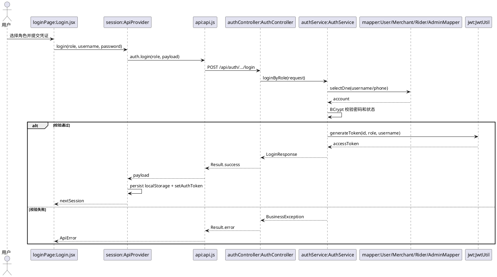
<!-- plantuml-image: 02-UC01-多角色注册、登录与会话建立 -->


### UC02 游客/用户发现商家与商品

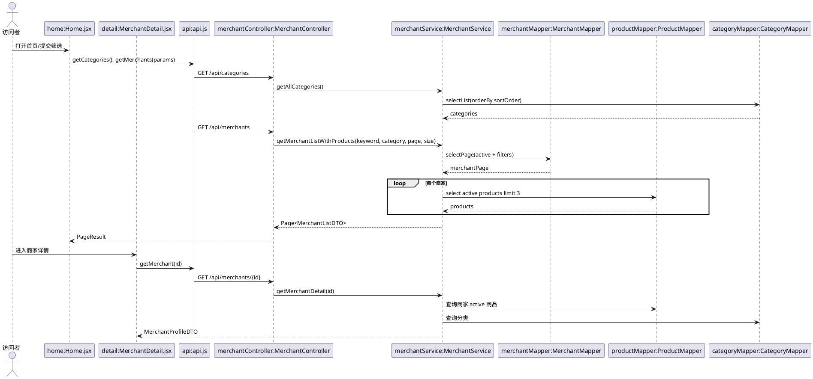
<!-- plantuml-image: 03-UC02-游客-用户发现商家与商品 -->


### UC03 基于位置/评分/销量获得推荐商家

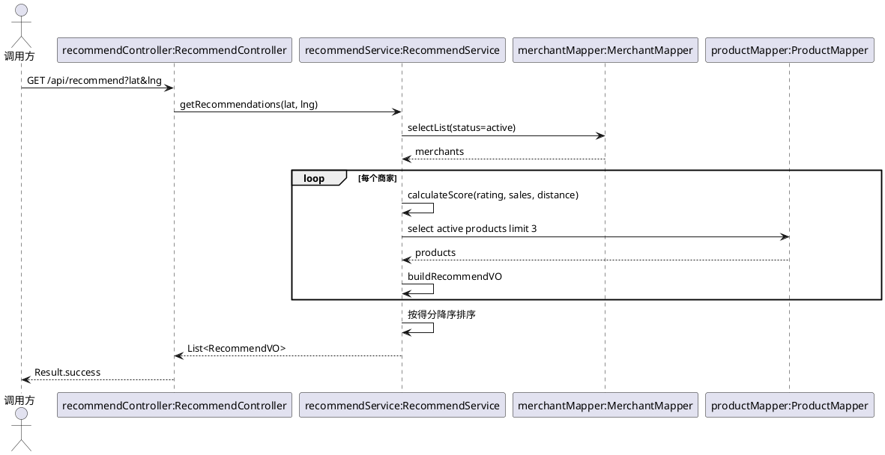
<!-- plantuml-image: 04-UC03-基于位置-评分-销量获得推荐商家 -->


### UC04 消费者维护个人资料和收货地址

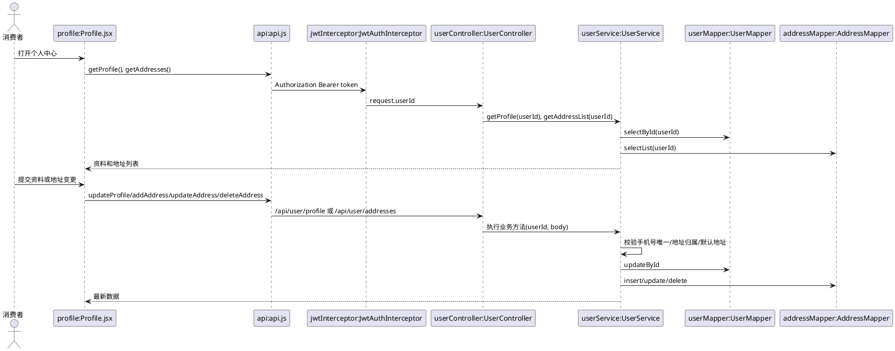
<!-- plantuml-image: 05-UC04-消费者维护个人资料和收货地址 -->


### UC05 消费者管理购物车并形成结算清单

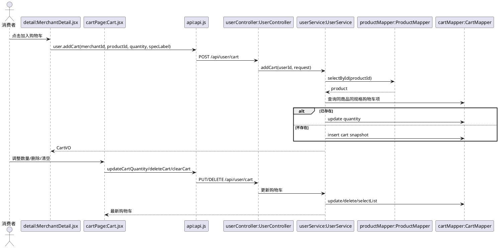
<!-- plantuml-image: 06-UC05-消费者管理购物车并形成结算清单 -->


### UC06 消费者领取并在订单中使用优惠券

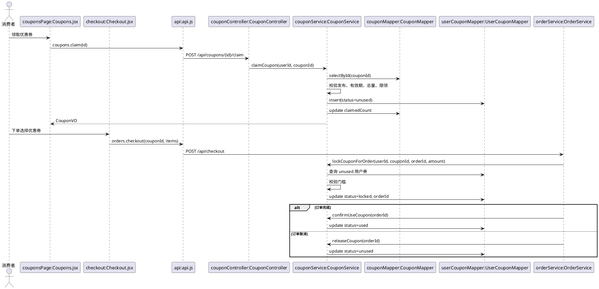
<!-- plantuml-image: 07-UC06-消费者领取并在订单中使用优惠券 -->


### UC07 消费者提交外卖订单

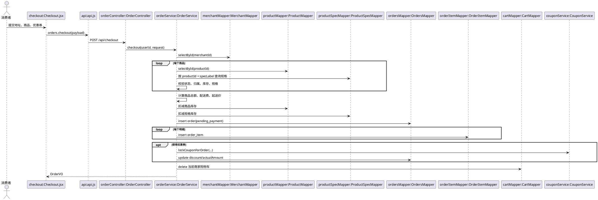
<!-- plantuml-image: 08-UC07-消费者提交外卖订单 -->


### UC08 消费者支付待支付订单

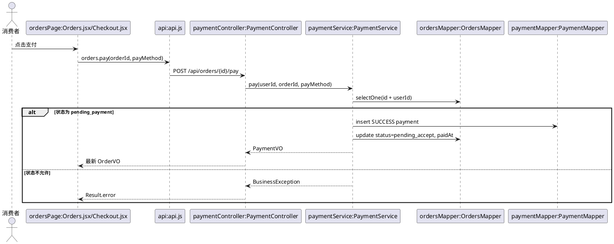
<!-- plantuml-image: 09-UC08-消费者支付待支付订单 -->


### UC09 消费者取消未完成订单

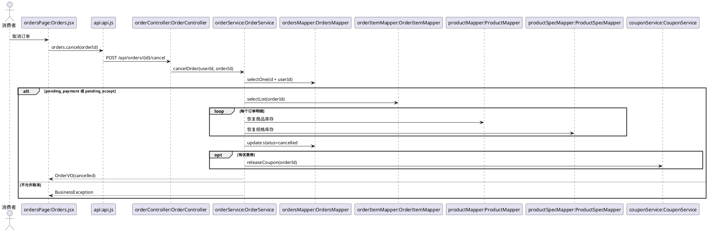
<!-- plantuml-image: 10-UC09-消费者取消未完成订单 -->


### UC10 消费者追踪配送并确认收货

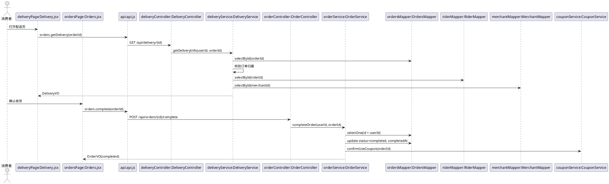
<!-- plantuml-image: 11-UC10-消费者追踪配送并确认收货 -->


### UC11 消费者评价已完成订单

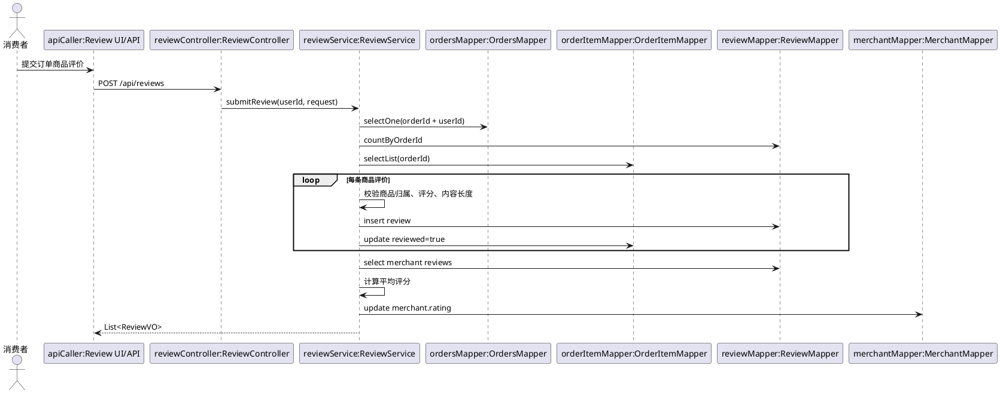
<!-- plantuml-image: 12-UC11-消费者评价已完成订单 -->


### UC12 商家注册/启用并进入经营后台

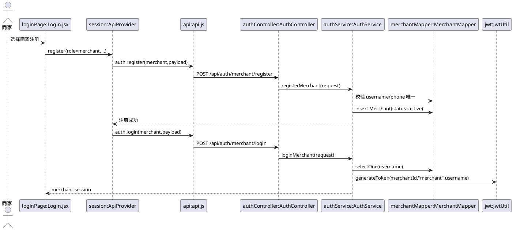
<!-- plantuml-image: 13-UC12-商家注册-启用并进入经营后台 -->


### UC13 商家维护店铺资料

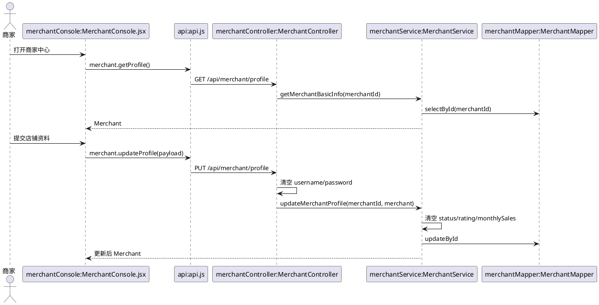
<!-- plantuml-image: 14-UC13-商家维护店铺资料 -->


### UC14 商家管理商品、规格与库存

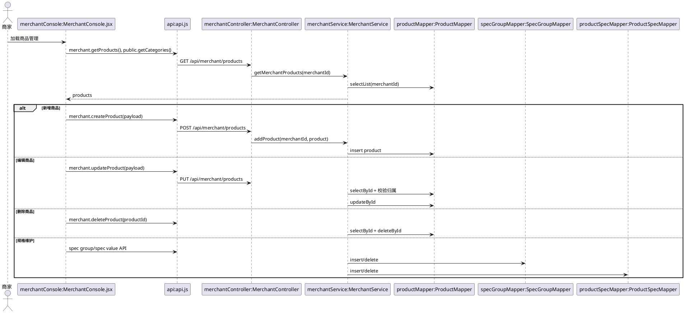
<!-- plantuml-image: 15-UC14-商家管理商品、规格与库存 -->


### UC15 商家处理本店订单

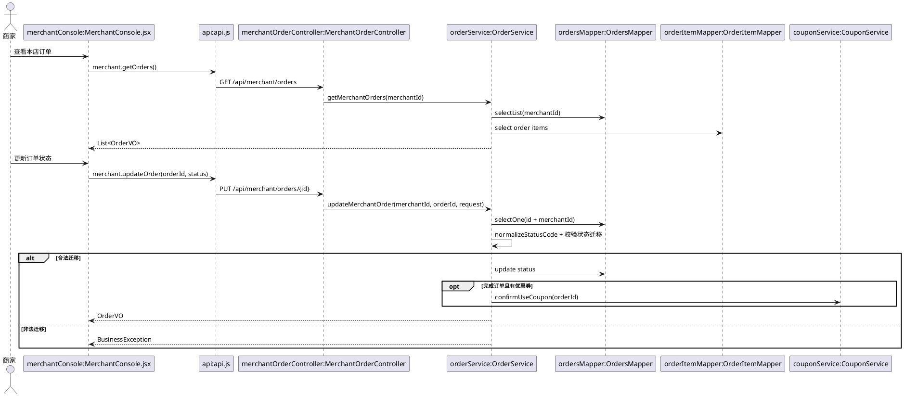
<!-- plantuml-image: 16-UC15-商家处理本店订单 -->


### UC16 骑手接单并完成配送

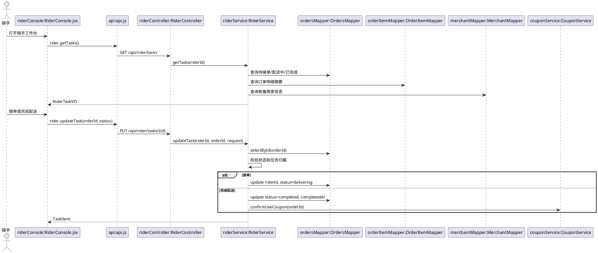
<!-- plantuml-image: 17-UC16-骑手接单并完成配送 -->


### UC17 骑手维护个人资料

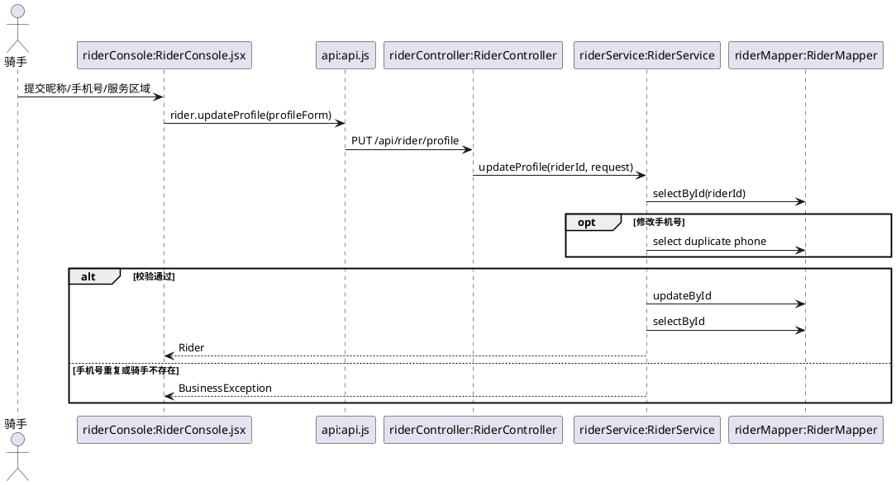
<!-- plantuml-image: 18-UC17-骑手维护个人资料 -->


### UC18 管理员管理用户/商家/骑手状态

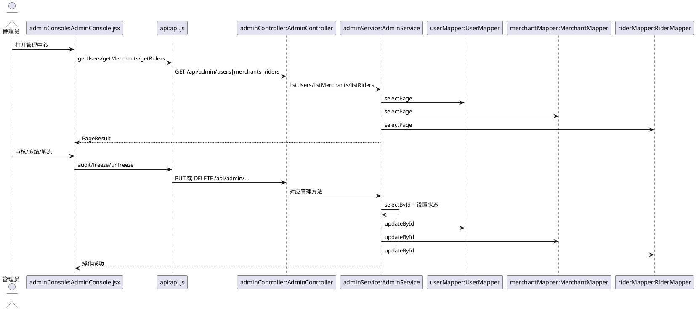
<!-- plantuml-image: 19-UC18-管理员管理用户-商家-骑手状态 -->


### UC19 管理员查看平台订单

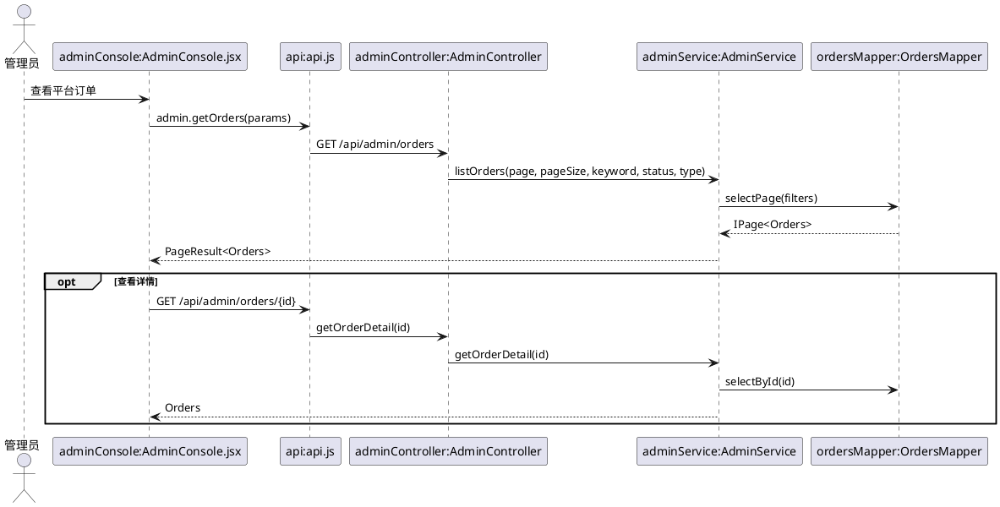
<!-- plantuml-image: 20-UC19-管理员查看平台订单 -->


### UC20 多角色查看运营看板

```plantuml
@startuml
actor 登录用户
participant "roleConsole:MerchantConsole/RiderConsole" as Page
participant "api:api.js" as Api
participant "dashboardController:DashboardController" as Controller
participant "dashboardService:DashboardService" as Service
participant "ordersMapper:OrdersMapper" as OrdersMapper

登录用户 -> Page : 进入角色中心
Page -> Api : dashboard.getMine()
Api -> Controller : GET /api/dashboard
Controller -> Controller : 读取 request.role/userId/merchantId/riderId
alt consumer
  Controller -> Service : getConsumerData(userId)
  Service -> OrdersMapper : 查询用户订单统计
else merchant
  Controller -> Service : getMerchantData(merchantId)
  Service -> OrdersMapper : 查询本店订单和收入
else rider
  Controller -> Service : getRiderData(riderId)
  Service -> OrdersMapper : 查询骑手任务和收入
end
Service --> Controller : DashboardVO 子数据
Controller --> Page : DashboardVO
@enduml
```
<!-- plantuml-image: 21-UC20-多角色查看运营看板 -->


### UC21 角色间订单会话沟通

```plantuml
@startuml
actor 发送方
actor 接收方
participant "messageController:MessageController" as Controller
participant "messageService:MessageService" as Service
participant "messageMapper:MessageMapper" as MessageMapper
participant "userMapper/User/Merchant/RiderMapper" as ActorMapper

发送方 -> Controller : POST /api/messages
Controller -> Controller : 从 JWT 映射 senderType
Controller -> Service : sendMessage(senderId, senderType, request)
Service -> MessageMapper : insert Message(isRead=false)
Service --> 发送方 : MessageVO
接收方 -> Controller : GET /api/messages?targetId&orderId
Controller -> Service : getMessages(userId, userType, targetId, orderId)
Service -> MessageMapper : 查询双方消息
Service -> MessageMapper : 将接收方未读消息 update isRead=true
Service --> 接收方 : List<MessageVO>
接收方 -> Controller : GET /api/messages/threads
Controller -> Service : getThreads(userId, userType)
Service -> MessageMapper : 查询相关消息
Service -> ActorMapper : 查询对方名称和头像
Service --> 接收方 : ThreadVO + unreadCount
@enduml
```
<!-- plantuml-image: 22-UC21-角色间订单会话沟通 -->


## 6 数据库表设计

当前数据库初始化脚本为 `backend/src/main/resources/db/init.sql`，测试库脚本为 `backend/src/test/resources/db/test-schema.sql`。核心表包括：`admin`、`user`、`merchant`、`rider`、`category`、`product`、`spec_group`、`product_spec`、`address`、`coupon`、`user_coupon`、`cart`、`orders`、`order_item`、`group_coupon`、`payment`、`review`、`message`。

## 7 接口设计

| 模块 | 接口入口 | 说明 |
|---|---|---|
| 认证 | `/api/auth/**` | 消费者、商家、骑手、管理员登录注册。 |
| 公共浏览 | `/api/merchants`、`/api/merchants/{id}`、`/api/products/{id}`、`/api/categories` | 商家和商品展示。 |
| 消费者 | `/api/user/**` | 资料、地址、购物车。 |
| 订单 | `/api/checkout`、`/api/orders/**` | 下单、订单列表、取消、完成。 |
| 支付 | `/api/orders/{id}/pay`、`/api/payments/{id}` | 模拟支付和支付记录。 |
| 优惠券 | `/api/coupons/**` | 可领券、我的券、领取。 |
| 配送 | `/api/delivery/{id}` | 配送追踪。 |
| 商家 | `/api/merchant/**` | 店铺、商品、规格和本店订单。 |
| 骑手 | `/api/rider/**` | 骑手资料和任务。 |
| 管理员 | `/api/admin/**` | 平台主体和订单管理。 |
| 评价 | `/api/reviews`、`/api/*/reviews` | 提交和查询评价。 |
| 搜索推荐 | `/api/search`、`/api/recommend` | 搜索和推荐。 |
| 消息 | `/api/messages/**` | 消息、线程、未读数。 |

## 8 测试设计

| 测试对象 | 当前测试 |
|---|---|
| 优惠券异常与生命周期 | `claimCouponRejectsEmptyInventoryAndNullLimit`、`releaseCouponClearsOrderBinding`、`riderCompletionMarksLockedCouponAsUsed` |
| 配送归属 | `deliveryInfoRequiresOrderOwner` |
| 用户-骑手完整主流程 | `fullConsumerRiderFlowWorksEndToEnd` |
| 商家订单状态 | `merchantApiAcceptsChineseStatusValue` |
| 库存预扣与取消恢复 | `checkoutReservesInventoryAndCancelRestoresIt` |
| 后端接口 E2E | `scripts/e2e-backend-test.ps1` |

建议补充：认证失败、管理员冻结/解冻、商家商品管理、评价重复提交、消息会话权限、搜索推荐排序等测试。

## 9 后续扩展点

1. 将评价、消息、搜索、推荐补齐前端入口和验收脚本。
2. 为管理员审核状态、消息接收方和商家规格归属增加更严格校验。
3. 如确需恢复原文档中的微服务方案，应拆分服务并新增 Gateway、Nacos、Redis 配置，不应仅在文档中声明。
4. 如需真实地图和钱包提现，应新增外部接口、数据表、权限规则和测试用例。

