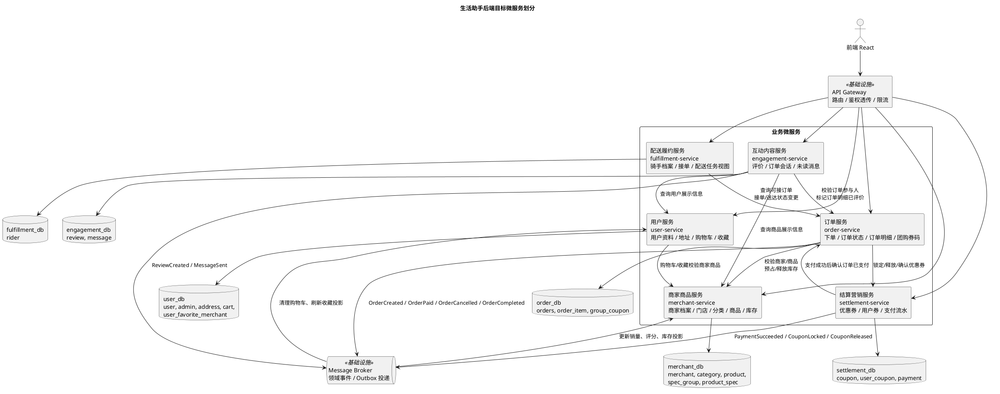

# 微服务划分与数据库归属

## 1. 当前目录架构理解

当前仓库是前后端分离的单体后端形态：

| 目录 | 当前职责 | 与本次拆分的关系 |
| --- | --- | --- |
| `backend/` | 单个 Spring Boot/Gradle 应用，入口为 `com.example.demo.DemoApplication`，业务包包括 `auth`、`user`、`merchant`、`order`、`payment`、`coupon`、`rider`、`delivery`、`review`、`message`、`search`、`recommend`、`dashboard` 等。 | 改造前代码版本。现有包名已经体现了业务域，但所有域共享一个进程、一个数据源和同一套 Mapper。 |
| `backend/src/main/resources/db/init.sql` | 初始化单库 `life_assistant`，包含 19 张业务表。 | 数据表归属的来源。改造后改为同一 MySQL 服务器上的多个 database/schema。 |
| `frontend/` | Vite/React 前端，调用 `/api/**`。 | 不计入业务微服务数量，改造后经 API Gateway 路由到各服务。 |
| `k8s/` | 当前单体后端、前端、MySQL 的部署样例。 | 改造后每个业务服务独立 Deployment/Service。 |
| `scripts/` | 启动、测试、初始化数据库、渲染 PlantUML 等脚本。 | 本文 PlantUML 图片使用 `scripts/render-plantuml.ps1` 生成。 |
| `tools/plantuml.jar` | PlantUML 渲染器。 | 用于生成本文服务划分图。 |

## 2. 改造前后代码版本

| 版本 | 代码形态 | 构建/测试/部署方式 | 说明 |
| --- | --- | --- | --- |
| 改造前 V1 单体版 | `backend/` 一个 Gradle 项目，一个 Spring Boot 进程。 | `cd backend && ./gradlew test`，单个 Dockerfile，单个后端 Deployment。 | 所有业务包共用 `life_assistant` 数据库，服务之间通过 Java 方法和 Mapper 直接访问彼此的数据表。 |
| 改造后 V2 微服务版 | 建议拆为 `services/user-service`、`services/merchant-service`、`services/order-service`、`services/settlement-service`、`services/fulfillment-service`、`services/engagement-service` 六个业务服务；`gateway`、注册/配置中心、前端和数据库不计入业务服务数量。 | 每个服务保留独立 `build.gradle`、`src/test`、`Dockerfile` 和 k8s Deployment，可分别执行 `./gradlew test`、构建镜像并独立发布。 | 每个服务只连自己的 database/schema。跨服务只能通过 REST/RPC、事件或消息访问，不跨库联表，不引用其他服务 Mapper。 |

> 本次提交的范围是服务划分和数据库归属设计，因此 V2 以目标目录和边界约束形式定义；实际迁移代码时应按本文边界逐服务搬迁 Controller/Service/Mapper，并为每个服务保留独立构建、测试和部署流水线。

## 3. 服务划分原则

1. 按核心业务能力拆分，而不是按接口数量拆分。商家商品、订单交易、结算营销、配送履约、用户侧资料、互动内容的生命周期、并发热点和数据一致性要求不同，适合拆开。
2. 一个业务表只有一个 Owner 服务。其他服务只能保存必要 ID 或业务快照，不能直接读写 Owner 的表。
3. 交易主流程使用同步接口完成强校验，跨服务状态变更使用本地事务加 Outbox 事件兜底，避免分布式事务。
4. 查询聚合由 API Gateway/BFF 或各服务提供聚合接口完成，不允许跨服务数据库联表。

## 4. 服务划分图

<!-- plantuml-image: 01-4.-服务划分图 -->

## 5. 业务服务职责和拆分理由

| 业务服务 | 目标模块 | 当前可迁移代码包 | 负责业务 | 拆分理由 | 独立构建测试部署 |
| --- | --- | --- | --- | --- | --- |
| 用户服务 `user-service` | `services/user-service` | `auth` 中用户/管理员登录注册能力、`user`、消费者 `dashboard` 片段 | 消费者账号资料、管理员账号、收货地址、购物车、收藏商家。 | 用户资料和购物车是消费者侧高频读写；购物车可保存商品快照，不应让订单或商家服务直接写用户表。 | 独立 Gradle 项目、独立 `user_db`，单测覆盖资料/地址/购物车/收藏，独立镜像和 Deployment。 |
| 商家商品服务 `merchant-service` | `services/merchant-service` | `auth` 中商家注册登录、`merchant`、`search`、`recommend` | 商家入驻档案、门店状态、分类、商品、规格、库存、商家/商品搜索和推荐。 | 商品和库存是下单前核心事实源；搜索推荐当前只依赖商家和商品数据，可先作为该服务查询能力，后续再拆索引服务。 | 独立 Gradle 项目、独立 `merchant_db`，测试覆盖商品上下架、规格、库存预占/释放，独立部署。 |
| 订单服务 `order-service` | `services/order-service` | `order`、订单相关 `dashboard` 片段 | 下单、订单状态流转、订单明细快照、团购券码、商家订单视图。 | 订单是交易聚合根，负责状态机和订单快照；不直接拥有商品、用户、优惠券、支付和骑手资料。 | 独立 Gradle 项目、独立 `order_db`，测试覆盖下单、取消、完成、商家改状态，独立部署。 |
| 结算营销服务 `settlement-service` | `services/settlement-service` | `coupon`、`payment` | 优惠券模板、用户领券/锁券/核销/释放、支付流水和支付回调。 | 金额、支付流水、优惠券库存需要独立一致性和幂等；订单只记录最终优惠和支付状态快照。 | 独立 Gradle 项目、独立 `settlement_db`，测试覆盖优惠券并发领取、锁定、支付幂等，独立部署。 |
| 配送履约服务 `fulfillment-service` | `services/fulfillment-service` | `auth` 中骑手注册登录、`rider`、`delivery` | 骑手档案、骑手审核状态、可接单列表、接单、配送中、送达、配送轨迹展示。 | 骑手资料和配送任务读模型与订单状态强相关，但不应由骑手服务直接修改订单表，应调用订单服务状态接口。 | 独立 Gradle 项目、独立 `fulfillment_db`，测试覆盖骑手资料、接单竞争、送达幂等，独立部署。 |
| 互动内容服务 `engagement-service` | `services/engagement-service` | `review`、`message` | 商品/商家评价、评价图片、订单关联会话、消息线程和未读数。 | 评价和消息是订单完成后的互动内容，写入失败不能阻塞订单主链路；通过事件回写评分、已评价状态。 | 独立 Gradle 项目、独立 `engagement_db`，测试覆盖评价资格、重复评价、消息参与人校验，独立部署。 |

## 6. 服务接口清单

### 6.1 对前端公开接口

| 目标服务 | 公开接口 | 来源接口或新接口 | 说明 |
| --- | --- | --- | --- |
| 用户服务 | `POST /api/auth/register`、`POST /api/auth/login`、`POST /api/auth/admin/login` | 当前 `AuthController` 用户/管理员部分 | 用户和管理员认证。JWT 可由用户服务签发，Gateway 只校验和透传身份。 |
| 用户服务 | `GET/PUT /api/user/profile`、`GET/POST/PUT/DELETE /api/user/addresses/**`、`GET/POST/PUT/DELETE /api/user/cart/**`、`GET/POST/DELETE /api/user/favorites/**` | 当前 `UserController` | 购物车保存商品名称、价格、图片等下单前快照，但商品有效性仍调用商家商品服务校验。 |
| 商家商品服务 | `POST /api/auth/merchant/register`、`POST /api/auth/merchant/login` | 当前 `AuthController` 商家部分 | 商家账号和门店资料同属商家商品服务，避免商家档案跨服务拆列。 |
| 商家商品服务 | `GET /api/merchants`、`GET /api/merchants/{id}`、`GET /api/products/{id}`、`GET /api/categories`、`GET/PUT /api/merchant/profile`、`GET/POST/PUT/DELETE /api/merchant/products/**`、`POST/DELETE /api/merchant/spec-groups/**`、`POST/DELETE /api/merchant/product-specs/**` | 当前 `MerchantController` | 门店、商品、规格和分类管理。 |
| 商家商品服务 | `GET /api/search`、`GET /api/recommend` | 当前 `SearchController`、`RecommendController` | 先作为商家商品服务读接口，后续需要专用索引时再拆搜索服务。 |
| 订单服务 | `GET /api/orders`、`GET /api/orders/{id}`、`POST /api/checkout`、`POST /api/orders/{id}/cancel`、`POST /api/orders/{id}/complete`、`GET/PUT /api/merchant/orders/**` | 当前 `OrderController`、`MerchantOrderController` | 订单主流程和商家订单管理。 |
| 结算营销服务 | `GET /api/coupons`、`GET /api/coupons/available`、`POST /api/coupons/{id}/claim`、`POST /api/orders/{id}/pay`、`GET /api/orders/{id}/payments`、`GET /api/payments/{id}` | 当前 `CouponController`、`PaymentController` | 支付接口对外仍保持订单路径，但由 Gateway 路由到结算营销服务。 |
| 配送履约服务 | `POST /api/auth/rider/register`、`POST /api/auth/rider/login`、`GET/PUT /api/rider/profile`、`GET /api/rider/tasks`、`PUT /api/rider/tasks/{id}`、`GET /api/delivery/{id}` | 当前 `AuthController` 骑手部分、`RiderController`、`DeliveryController` | 骑手和配送视图；订单状态变化经订单服务接口完成。 |
| 互动内容服务 | `POST /api/reviews`、`POST /api/reviews/images`、`GET /api/products/{id}/reviews`、`GET /api/merchants/{id}/reviews`、`GET /api/merchants/{id}/rating`、`GET /api/user/reviews`、`POST/GET /api/messages/**` | 当前 `ReviewController`、`MessageController` | 评价和消息。 |

### 6.2 服务间内部接口和事件

| 提供方 | 接口/事件 | 调用方 | 用途 |
| --- | --- | --- | --- |
| 商家商品服务 | `GET /internal/merchants/{merchantId}` | 用户、订单、配送、互动 | 获取商家状态、名称、头像、地址、配送费、起送价等展示或校验快照。 |
| 商家商品服务 | `POST /internal/products/quote` | 用户、订单 | 按商品 ID 和规格返回商品快照、价格、库存、所属商家。 |
| 商家商品服务 | `POST /internal/inventory/reservations`、`DELETE /internal/inventory/reservations/{reservationId}`、`POST /internal/inventory/reservations/{reservationId}/commit` | 订单 | 下单时预占库存，订单取消或失败时释放，支付或商家接单后确认扣减。 |
| 用户服务 | `GET /internal/users/{userId}`、`GET /internal/users/{userId}/addresses/{addressId}` | 订单、互动 | 校验用户状态，读取地址快照。订单表只保存 `address_detail` 快照。 |
| 用户服务 | `DELETE /internal/users/{userId}/cart?merchantId=` 或消费 `OrderCreated` 事件 | 订单 | 下单成功后清理对应商家的购物车。优先事件异步清理，接口作为同步兜底。 |
| 结算营销服务 | `POST /internal/coupon-locks`、`POST /internal/coupon-locks/{orderId}/release`、`POST /internal/coupon-locks/{orderId}/confirm` | 订单、配送 | 锁定、取消释放、完成核销用户券。 |
| 结算营销服务 | `PaymentSucceeded` 事件 | 订单 | 支付成功后推进订单到待接单。事件包含 `orderId`、`amount`、`transactionId`、`paidAt`。 |
| 订单服务 | `GET /internal/orders/{orderId}` | 结算、配送、互动 | 校验订单存在、归属、金额、状态、参与人和商品明细快照。 |
| 订单服务 | `POST /internal/orders/{orderId}/mark-paid` | 结算 | 支付成功后幂等推进订单状态。 |
| 订单服务 | `POST /internal/orders/{orderId}/assign-rider`、`POST /internal/orders/{orderId}/delivered` | 配送履约 | 接单和送达。订单服务负责订单状态机和并发控制。 |
| 订单服务 | `POST /internal/orders/{orderId}/reviewed-items` | 互动内容 | 评价成功后标记 `order_item.reviewed`。 |
| 配送履约服务 | `GET /internal/riders/{riderId}` | 订单、互动 | 校验骑手状态和展示骑手名称/电话。 |
| 互动内容服务 | `ReviewCreated` 事件 | 商家商品、订单 | 商家商品服务更新评分投影，订单服务标记明细已评价；失败由 Outbox 重试。 |
| 互动内容服务 | `MessageSent` 事件 | 用户、商家、配送 | 可选推送/未读提醒，不作为消息写入成功的前置条件。 |

## 7. 数据表归属表

| 当前业务表 | Owner 服务 | 目标 database/schema | 归属理由 | 其他服务访问方式 |
| --- | --- | --- | --- | --- |
| `admin` | 用户服务 | `user_db.admin` | 管理员认证和账号状态属于平台用户体系。 | Gateway 校验 token；其他服务不查管理员表。 |
| `user` | 用户服务 | `user_db.user` | 消费者身份、手机号、昵称、头像、状态是用户服务核心数据。 | 通过 `GET /internal/users/{userId}` 获取必要快照。 |
| `address` | 用户服务 | `user_db.address` | 地址生命周期由消费者维护，下单时只复制地址快照。 | 订单服务调用地址接口，不直接读表。 |
| `cart` | 用户服务 | `user_db.cart` | 购物车属于消费者侧临时状态，保留商品快照便于展示。 | 订单创建成功后发事件清理，订单不直接删表。 |
| `user_favorite_merchant` | 用户服务 | `user_db.user_favorite_merchant` | 收藏是用户偏好数据。 | 商家下架/冻结通过事件刷新收藏展示状态。 |
| `merchant` | 商家商品服务 | `merchant_db.merchant` | 当前表同时承载商家账号、门店资料、评分、销量和配送规则；这些是门店经营事实源。 | 登录由商家商品服务处理；其他服务通过内部商家接口取快照。 |
| `category` | 商家商品服务 | `merchant_db.category` | 商品分类是商品目录的一部分。 | 只通过分类公开接口查询。 |
| `product` | 商家商品服务 | `merchant_db.product` | 商品、价格、库存、上下架状态是下单校验事实源。 | 订单和购物车通过商品报价/库存接口访问。 |
| `spec_group` | 商家商品服务 | `merchant_db.spec_group` | 规格分组依附商品。 | 通过商品详情或商品报价接口访问。 |
| `product_spec` | 商家商品服务 | `merchant_db.product_spec` | 规格价格和规格库存依附商品。 | 通过商品详情或库存预占接口访问。 |
| `orders` | 订单服务 | `order_db.orders` | 订单是交易聚合根，负责状态机、金额快照和参与人 ID。 | 结算、配送、互动通过订单内部接口读状态或请求状态变更。 |
| `order_item` | 订单服务 | `order_db.order_item` | 订单明细是下单时商品名称、价格、图片、规格的不可变快照。 | 评价通过订单接口校验明细并标记已评价。 |
| `group_coupon` | 订单服务 | `order_db.group_coupon` | 团购券码随订单明细生成和履约，是订单交付物。 | 其他服务通过订单详情接口查看，不直接读表。 |
| `coupon` | 结算营销服务 | `settlement_db.coupon` | 优惠券模板、投放数量、门槛和有效期属于营销规则。 | 订单通过锁券接口获取可抵扣金额。 |
| `user_coupon` | 结算营销服务 | `settlement_db.user_coupon` | 用户领券、锁定、核销、释放需要与营销库存一致。 | 订单只保存 `coupon_id` 和 `discount` 快照。 |
| `payment` | 结算营销服务 | `settlement_db.payment` | 支付流水、交易号和支付状态属于结算域，需要幂等。 | 订单通过支付成功事件/内部接口更新支付状态。 |
| `rider` | 配送履约服务 | `fulfillment_db.rider` | 骑手资质、服务区域、状态和配送身份属于履约域。 | 订单、消息通过骑手内部接口获取展示快照和状态校验。 |
| `review` | 互动内容服务 | `engagement_db.review` | 评价内容、图片、评分是互动内容域数据。 | 商家评分通过 `ReviewCreated` 事件更新投影，不直接查评价表。 |
| `message` | 互动内容服务 | `engagement_db.message` | 订单会话、消息已读、线程未读数属于互动内容域。 | 发送前调用参与人和订单校验接口，不直接查用户/订单表。 |

## 8. 跨服务调用和失败处理

| 场景 | 正常流程 | 调用失败处理 |
| --- | --- | --- |
| 加入购物车 | 用户服务调用商家商品服务 `POST /internal/products/quote` 校验商品、规格和门店状态，然后在 `cart` 保存商品快照。 | 商品服务不可用时返回可重试错误，不写购物车；前端提示稍后重试。 |
| 下单结算 | 订单服务调用商家商品服务校验商家、商品、价格和库存，并创建库存预占；调用结算营销服务锁定优惠券；订单本地事务写 `orders`、`order_item`、`group_coupon` 和 Outbox。 | 库存预占失败直接终止；优惠券锁定失败则调用释放库存接口；订单本地写入失败则通过补偿任务释放库存和优惠券锁。所有预占接口带 `orderNo` 幂等键。 |
| 支付订单 | 结算营销服务校验订单金额和状态，写入 `payment`，发布 `PaymentSucceeded`，并调用订单服务 `mark-paid`。 | 支付成功但订单接口失败时，支付流水保持成功，Outbox 持续重试 `PaymentSucceeded`；订单服务按 `transactionId` 幂等处理，避免重复推进状态。 |
| 取消订单 | 订单服务本地改为 `cancelled` 并发布 `OrderCancelled`。商家商品服务释放库存，结算营销服务释放用户券。 | 事件投递失败由 Outbox 重试；库存/券释放接口必须幂等。若某补偿长期失败，进入人工补偿队列并保持订单取消状态可见。 |
| 骑手接单/送达 | 配送履约服务校验骑手状态后调用订单服务 `assign-rider` 或 `delivered`；订单服务用状态和 `riderId is null` 条件保证并发安全。 | 接单冲突返回 409，骑手端刷新任务列表；送达失败不写履约本地状态，允许重试。完成事件触发结算营销服务确认核销优惠券。 |
| 提交评价 | 互动内容服务调用订单服务校验订单完成、用户归属和商品明细，写入 `review`，发布 `ReviewCreated`，再请求订单服务标记明细已评价。 | 订单校验失败不写评价；评价写入成功但标记明细或更新评分失败时，通过 Outbox 重试。重复提交使用 `orderId + productId` 幂等约束或业务校验拒绝。 |
| 发送订单消息 | 互动内容服务调用订单服务校验发送方、接收方都是订单参与人；按接收方类型调用用户、商家或配送服务校验目标存在，然后写 `message`。 | 任一校验服务不可用则不写消息并返回可重试错误；消息写入后推送事件失败不影响已发送消息，由事件重试补发通知。 |
| 搜索/推荐/仪表盘 | 商家商品服务负责商家/商品搜索推荐；仪表盘改为 Gateway/BFF 聚合各服务统计接口，或由各 Owner 服务提供自己的统计片段。 | 聚合接口部分失败时返回降级数据和明确缺失字段，不跨库联表兜底。 |

## 9. 需要重点消除的现有跨表直连

| 当前代码位置 | 当前耦合 | 改造后替代方式 |
| --- | --- | --- |
| `OrderService` | 直连 `MerchantMapper`、`ProductMapper`、`ProductSpecMapper`、`CartMapper`、`CouponService`。 | 调商家商品服务报价/库存接口，调结算营销服务锁券接口，发事件让用户服务清购物车。 |
| `PaymentService` | 直连 `OrdersMapper` 并直接改订单状态。 | 结算营销服务写支付流水，调用订单服务 `mark-paid` 或发布 `PaymentSucceeded`。 |
| `ReviewService` | 直连订单、订单明细、用户、商家、商品，并回写商家评分。 | 互动内容服务调用订单/用户/商家商品内部接口校验和取快照，通过事件更新评分和已评价状态。 |
| `RiderService`、`DeliveryService` | 骑手侧直接读写订单表，并查商家表。 | 配送履约服务通过订单服务领取/完成任务，通过商家商品服务读取商家地址快照。 |
| `MessageService` | 直连用户、商家、骑手、订单表校验会话。 | 互动内容服务调用各 Owner 服务校验参与人和订单权限。 |
| `DashboardService` | 一个服务里直接汇总订单、骑手、商家、收藏。 | 改为 Gateway/BFF 聚合，或各 Owner 服务提供统计片段。 |

## 10. 数据隔离落地约束

1. 每个业务服务使用独立数据库账号，账号只授予本服务 schema 的读写权限。
2. 表间跨服务关系只保留 ID 和快照字段，不建立跨 schema 外键。
3. 禁止在代码中引入其他服务的 Mapper、Entity 或直接配置其他服务数据源。
4. 需要跨服务查询时优先调用 Owner 服务接口；高频展示字段通过领域事件维护本服务投影或快照。
5. 每个跨服务写操作必须具备幂等键、超时、重试、补偿或人工处理入口。

