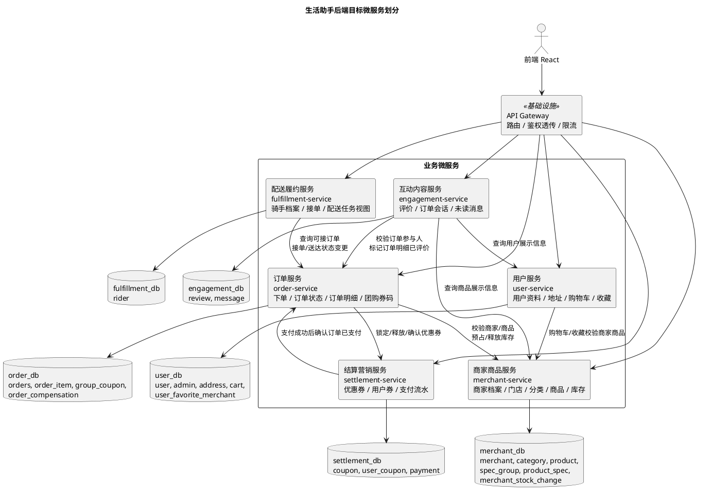

# 微服务划分与数据库归属

## 1. 当前目录架构理解

当前仓库已经从旧单体后端切换为前后端分离的微服务运行态。旧 `backend/` 单体源码不再位于主干目录，当前后端由 `services/` 下的独立 Spring Boot 服务实现，前端经 API Gateway 统一访问 `/api/**`。

| 目录 | 当前职责 | 与本次拆分的关系 |
| --- | --- | --- |
| `services/api-gateway` | Spring Cloud Gateway 统一入口，按路径路由到 Nacos 中的服务名。 | 负责 `/api/**` 路由、CORS 和请求头透传，不拥有业务表。 |
| `services/common-lib` | 公共响应、异常、JWT 拦截器、MyBatis 配置、健康检查、验证码、跨服务契约 DTO。 | 所有业务服务通过 Gradle composite build 依赖，不能复制公共源码。 |
| `services/merchant-service` | 商家认证、公开商家/商品目录、分类、搜索、推荐、内部商家/商品快照、商品报价、库存预占/释放状态。 | Owner `merchant_db`。 |
| `services/user-service` | 消费者和管理员认证、用户资料、地址、购物车、收藏、用户内部快照、购物车清理。 | Owner `user_db`。 |
| `services/order-service` | 消费者订单、下单、取消、完成、商家订单、管理员订单、订单内部查询、支付推进、履约任务代理、评价标记。 | Owner `order_db`。 |
| `services/settlement-service` | 优惠券列表、领券、锁券、释放、核销、支付流水、模拟支付成功。 | Owner `settlement_db`。 |
| `services/fulfillment-service` | 骑手认证、骑手资料、骑手任务、骑手看板、配送追踪、管理员骑手管理、骑手内部快照。 | Owner `fulfillment_db`。 |
| `services/engagement-service` | 评价、评价/通用图片上传、商品/商家评价查询、商家评分、用户评价、订单会话、消息线程、未读数。 | Owner `engagement_db`。 |
| `db/microservices/` | 多 schema 初始化 SQL 和非破坏性补齐脚本。 | Docker Compose 和 K8s 初始化共用。 |
| `frontend/` | Vite/React 前端，运行时调用 `/api/**`。 | 不计入业务微服务数量，经 API Gateway 路由到各服务；部分商家管理接口目前仍只在前端 mock 中完整覆盖。 |
| `k8s/` | MySQL、Redis、Nacos、业务服务、Gateway、前端的 Kubernetes 示例清单。 | 每个业务服务独立 Deployment/Service。 |
| `scripts/` | 启动、测试、初始化数据库、kind 部署、PlantUML 渲染脚本。 | 收尾验收和 CI/CD 的脚本基础。 |

## 2. 改造前后代码版本

| 版本 | 代码形态 | 构建/测试/部署方式 | 说明 |
| --- | --- | --- | --- |
| 改造前 V1 单体版 | `backend/` 一个 Gradle 项目，一个 Spring Boot 进程；当前主干已移除。 | 单个后端构建、单个镜像、单个 Deployment。 | 所有业务包共用 `life_assistant` 数据库，服务之间通过 Java 方法和 Mapper 直接访问彼此的数据表。 |
| 当前 V2 微服务版 | `services/user-service`、`services/merchant-service`、`services/order-service`、`services/settlement-service`、`services/fulfillment-service`、`services/engagement-service` 六个业务服务，加 `api-gateway` 和 `common-lib`。 | 每个服务保留独立 `build.gradle`、`src/test`、`Dockerfile` 和 k8s Deployment，可分别执行 `./gradlew test`、构建镜像并独立发布；根脚本 `scripts/test-microservices.ps1` 可批量验证。 | 每个业务服务只连自己的 database/schema。跨服务访问通过 OpenFeign + Nacos 服务名，不跨库联表，不引用其他服务 Mapper。 |

## 3. 服务划分原则

1. 按核心业务能力拆分，而不是按接口数量拆分。商家商品、订单交易、结算营销、配送履约、用户侧资料、互动内容的生命周期、并发热点和数据一致性要求不同，适合拆开。
2. 一个业务表只有一个 Owner 服务。其他服务只能保存必要 ID 或业务快照，不能直接读写 Owner 的表。
3. 交易主流程使用 OpenFeign 同步接口完成强校验；当前阶段不引入消息队列，失败兜底以本地补偿记录、幂等请求和可重试接口为主。领域事件可作为后续扩展，不作为当前实现前置条件。
4. 查询聚合由 API Gateway/BFF 或各服务提供聚合接口完成，不允许跨服务数据库联表。

## 4. 服务划分图

<!-- plantuml-image: 01-4.-服务划分图 -->

## 5. 业务服务职责和拆分理由

| 业务服务 | 目标模块 | 当前可迁移代码包 | 负责业务 | 拆分理由 | 独立构建测试部署 |
| --- | --- | --- | --- | --- | --- |
| 用户服务 `user-service` | `services/user-service` | `auth` 中用户/管理员登录注册能力、`user`、消费者资料能力 | 消费者账号资料、管理员账号、收货地址、购物车、收藏商家。 | 用户资料和购物车是消费者侧高频读写；购物车可保存商品快照，不应让订单或商家服务直接写用户表。 | 独立 Gradle 项目、独立 `user_db`，测试覆盖认证、资料、地址、购物车、收藏、管理员用户管理，独立镜像和 Deployment。 |
| 商家商品服务 `merchant-service` | `services/merchant-service` | `auth` 中商家注册登录、`merchant`、`search`、`recommend` | 商家入驻档案、门店状态、分类、商品、规格、库存、商家/商品搜索和推荐。 | 商品和库存是下单前核心事实源；搜索推荐当前只依赖商家和商品数据，可先作为该服务查询能力，后续再拆索引服务。 | 独立 Gradle 项目、独立 `merchant_db`，测试覆盖商品上下架、规格、库存预占/释放，独立部署。 |
| 订单服务 `order-service` | `services/order-service` | `order`、订单相关 `dashboard` 片段 | 下单、订单状态流转、订单明细快照、团购券码、商家订单视图。 | 订单是交易聚合根，负责状态机和订单快照；不直接拥有商品、用户、优惠券、支付和骑手资料。 | 独立 Gradle 项目、独立 `order_db`，测试覆盖下单、取消、完成、商家改状态，独立部署。 |
| 结算营销服务 `settlement-service` | `services/settlement-service` | `coupon`、`payment` | 优惠券模板、用户领券/锁券/核销/释放、支付流水和模拟支付成功。 | 金额、支付流水、优惠券库存需要独立一致性和幂等；订单只记录最终优惠和支付状态快照。 | 独立 Gradle 项目、独立 `settlement_db`，测试覆盖领券、锁券、释放、支付幂等，独立部署。 |
| 配送履约服务 `fulfillment-service` | `services/fulfillment-service` | `auth` 中骑手注册登录、`rider`、`delivery` | 骑手档案、骑手审核状态、可接单列表、接单、配送中、送达、配送轨迹展示。 | 骑手资料和配送任务读模型与订单状态强相关，但不应由骑手服务直接修改订单表，应调用订单服务状态接口。 | 独立 Gradle 项目、独立 `fulfillment_db`，测试覆盖骑手资料、接单竞争、送达幂等，独立部署。 |
| 互动内容服务 `engagement-service` | `services/engagement-service` | `review`、`message` | 商品/商家评价、评价和通用图片上传、订单关联会话、消息线程和未读数。 | 评价和消息是订单完成后的互动内容，写入失败不能阻塞订单主链路；当前通过订单内部接口标记已评价，通过日志型事件发布器预留后续事件化扩展。 | 独立 Gradle 项目、独立 `engagement_db`，测试覆盖评价资格、重复评价、图片上传、消息参与人校验，独立部署。 |

## 6. 服务接口清单

### 6.1 对前端公开接口

| 目标服务 | 当前后端已暴露接口 | 来源控制器 | 说明 |
| --- | --- | --- | --- |
| 公共能力 | `GET /api/health`、`GET /api/captcha` | `HealthController`、`CaptchaController` in `common-lib` | 所有接入公共包的业务服务都有健康检查；验证码主要由认证服务使用。 |
| 用户服务 | `POST /api/auth/register`、`POST /api/auth/login`、`POST /api/auth/admin/login` | `user-service/AuthController` | 用户和管理员认证，JWT 由用户服务签发。 |
| 用户服务 | `GET/PUT /api/user/profile`、`GET/POST/PUT/DELETE /api/user/addresses/**`、`GET/POST/PUT/DELETE /api/user/cart/**`、`GET/POST/DELETE /api/user/favorites/**` | `UserController` | 购物车保存商品名称、价格、图片等下单前快照，添加购物车时调用商家商品服务报价接口校验。 |
| 用户服务 | `GET /api/admin/users`、`DELETE /api/admin/users/{id}`、`PUT /api/admin/users/{id}/unfreeze` | `AdminUserController` | 管理员用户列表、冻结、解冻。 |
| 商家商品服务 | `POST /api/auth/merchant/register`、`POST /api/auth/merchant/login` | `merchant-service/AuthController` | 商家账号和门店主体同属商家商品服务。 |
| 商家商品服务 | `GET /api/merchants`、`GET /api/merchants/{id}`、`GET /api/products/{id}`、`GET /api/categories` | `MerchantController` | 当前后端已落地的是公开目录浏览，不包含商家后台商品管理写接口。 |
| 商家商品服务 | `GET /api/search`、`GET /api/recommend` | `SearchController`、`RecommendController` | 搜索和推荐暂作为商家商品服务读能力。 |
| 订单服务 | `GET /api/orders`、`GET /api/orders/{id}`、`POST /api/checkout`、`POST /api/orders/{id}/cancel`、`POST /api/orders/{id}/complete` | `OrderController` | 消费者订单主流程。 |
| 订单服务 | `GET /api/merchant/orders`、`PUT /api/merchant/orders/{id}` | `MerchantOrderController` | 商家订单列表和订单状态更新；商家身份来自 JWT 中的 `merchantId`，不再由查询参数传入。 |
| 订单服务 | `GET /api/admin/orders`、`GET /api/admin/orders/{id}` | `AdminOrderController` | 管理员订单列表和订单详情。 |
| 结算营销服务 | `GET /api/coupons`、`GET /api/coupons/available`、`POST /api/coupons/{id}/claim` | `CouponController` | 用户券列表、可领取券、领券。 |
| 结算营销服务 | `POST /api/orders/{id}/pay`、`GET /api/orders/{id}/payments`、`GET /api/payments/{id}` | `PaymentController` | 支付接口对外保持订单路径，由 Gateway 以高优先级路由到结算营销服务。 |
| 配送履约服务 | `POST /api/auth/rider/register`、`POST /api/auth/rider/login` | `fulfillment-service/AuthController` | 骑手认证。 |
| 配送履约服务 | `GET/PUT /api/rider/profile`、`GET /api/rider/dashboard`、`GET /api/rider/tasks`、`PUT /api/rider/tasks/{id}` | `RiderController` | 骑手资料、看板、任务列表、接单/送达状态更新。 |
| 配送履约服务 | `GET /api/delivery/{id}`、`GET /api/admin/riders`、`PUT /api/admin/riders/{id}/audit`、`DELETE /api/admin/riders/{id}`、`PUT /api/admin/riders/{id}/unfreeze` | `DeliveryController`、`AdminRiderController` | 配送追踪与管理员骑手管理。 |
| 互动内容服务 | `POST /api/reviews`、`POST /api/reviews/images`、`POST /api/uploads/images`、`GET /api/products/{id}/reviews`、`GET /api/merchants/{id}/reviews`、`GET /api/merchants/{id}/rating`、`GET /api/user/reviews` | `ReviewController` | 评价、评价图片、通用图片上传、评价查询。注意当前 Gateway 需优先路由 `/api/user/reviews` 到 engagement-service，否则会被 `/api/user/**` 路由截获。 |
| 互动内容服务 | `POST /api/messages`、`GET /api/messages`、`GET /api/messages/threads`、`GET /api/messages/unread-count`、`GET /api/messages/orders/{orderId}` | `MessageController` | 订单参与方消息、线程、未读数和会话关联订单代理查询。 |

### 6.1.1 当前接口契约差异和待补齐项

| 差异项 | 当前状态 | 收尾建议 |
| --- | --- | --- |
| 商家后台资料和商品管理 | 前端 `frontend/src/utils/api.js` 调用了 `/api/merchant/dashboard`、`GET/PUT /api/merchant/profile`、`GET/POST/PUT/DELETE /api/merchant/products/**`，Gateway 也预留了 `/api/merchant/**` 到 `merchant-service` 的路由；但当前 `merchant-service` 没有对应 Controller。 | 若本阶段只要求前端 mock 演示，应在交付说明中标注为 mock 能力；若要真实后端闭环，需要在 `merchant-service` 增加商家资料、商品 CRUD、商家看板接口。 |
| 管理员商家管理 | 前端和 Gateway 记录了 `/api/admin/merchants/**`，当前后端未看到 `AdminMerchantController`。 | 与商家后台同属 `merchant-service` 待补齐后端接口。 |
| 当前用户评价 | `engagement-service` 已实现 `GET /api/user/reviews`，但 Gateway 中 `/api/user/**` 路由位于 engagement-service 路由之前。 | Gateway 增加高优先级 `/api/user/reviews` 到 `engagement-service`，或改接口路径为 `/api/reviews/mine` 并同步前端。 |
| 购物车接口路径 | 旧前端文档仍记录 `/api/cart/items` 和 `/api/cart/clear`。 | 当前真实后端和 `frontend/src/utils/api.js` 使用 `/api/user/cart`、`/api/user/cart/{id}`、`DELETE /api/user/cart`，旧路径应视为废弃。 |

### 6.2 服务间内部接口和事件

| 提供方 | 接口/事件 | 调用方 | 用途 |
| --- | --- | --- | --- |
| 商家商品服务 | `GET /internal/merchants/{merchantId}` | 用户、订单、配送、互动 | 获取商家状态、名称、头像、地址、配送费、起送价等展示或校验快照。 |
| 商家商品服务 | `POST /internal/products/quote` | 用户、订单 | 按商品 ID 和规格返回商品快照、价格、库存、所属商家。 |
| 商家商品服务 | `POST /internal/products/reserve`、`POST /internal/products/release`、`GET /internal/products/changes/{requestId}` | 订单 | 下单时预占库存，订单取消或失败时释放，通过 `requestId` 查询库存变更状态；当前未实现单独 commit 接口。 |
| 用户服务 | `GET /internal/users/{userId}`、`GET /internal/users/{userId}/addresses/{addressId}` | 订单、互动 | 校验用户状态，读取地址快照。订单表只保存 `address_detail` 快照。 |
| 用户服务 | `DELETE /internal/users/{userId}/cart?merchantId=` | 订单 | 下单成功后清理对应商家的购物车；当前为同步尽力调用，失败不回滚订单。 |
| 结算营销服务 | `POST /internal/coupon-locks`、`POST /internal/coupon-locks/{orderId}/release`、`POST /internal/coupon-locks/{orderId}/confirm` | 订单、配送 | 锁定、取消释放、完成核销用户券。 |
| 结算营销服务 | `POST /internal/payments/mock-success` | 订单 | 模拟支付成功，写支付流水后调用订单服务 `mark-paid`；当前不是消息事件。 |
| 订单服务 | `GET /internal/orders/{orderId}` | 结算、配送、互动 | 校验订单存在、归属、金额、状态、参与人和商品明细快照。 |
| 订单服务 | `POST /internal/orders/{orderId}/mark-paid` | 结算 | 支付成功后幂等推进订单状态。 |
| 订单服务 | `GET /internal/fulfillment/tasks/available`、`GET /internal/fulfillment/tasks/assigned?riderId=`、`GET /internal/fulfillment/tasks/completed?riderId=`、`POST /internal/fulfillment/orders/{orderId}/assign-rider`、`POST /internal/fulfillment/orders/{orderId}/delivered`、`GET /internal/fulfillment/orders/{orderId}?riderId=` | 配送履约 | 骑手任务读模型、接单、送达和配送追踪代理。订单服务负责订单状态机和并发控制。 |
| 订单服务 | `POST /internal/orders/{orderId}/reviewed-items` | 互动内容 | 评价成功后标记 `order_item.reviewed`。 |
| 配送履约服务 | `GET /internal/riders/{riderId}` | 订单、互动 | 校验骑手状态和展示骑手名称/电话。 |
| 互动内容服务 | 日志型 `ReviewCreated`、`MessageSent` 发布器 | 后续订阅方 | 当前 `EngagementEventPublisher` 仅作为日志/扩展点，不依赖消息中间件；订单已评价通过 `POST /internal/orders/{orderId}/reviewed-items` 同步完成。 |

## 7. 数据表归属表

| 当前业务表 | Owner 服务 | 目标 database/schema | 归属理由 | 其他服务访问方式 |
| --- | --- | --- | --- | --- |
| `admin` | 用户服务 | `user_db.admin` | 管理员认证和账号状态属于平台用户体系。 | Gateway 校验 token；其他服务不查管理员表。 |
| `user` | 用户服务 | `user_db.user` | 消费者身份、手机号、昵称、头像、状态是用户服务核心数据。 | 通过 `GET /internal/users/{userId}` 获取必要快照。 |
| `address` | 用户服务 | `user_db.address` | 地址生命周期由消费者维护，下单时只复制地址快照。 | 订单服务调用地址接口，不直接读表。 |
| `cart` | 用户服务 | `user_db.cart` | 购物车属于消费者侧临时状态，保留商品快照便于展示。 | 订单创建成功后调用用户服务内部清理接口，订单不直接删表。 |
| `user_favorite_merchant` | 用户服务 | `user_db.user_favorite_merchant` | 收藏是用户偏好数据。 | 收藏新增和展示时调用商家商品服务校验/补齐商家状态，当前不做事件同步。 |
| `merchant` | 商家商品服务 | `merchant_db.merchant` | 当前表同时承载商家账号、门店资料、评分、销量和配送规则；这些是门店经营事实源。 | 登录由商家商品服务处理；其他服务通过内部商家接口取快照。 |
| `category` | 商家商品服务 | `merchant_db.category` | 商品分类是商品目录的一部分。 | 只通过分类公开接口查询。 |
| `product` | 商家商品服务 | `merchant_db.product` | 商品、价格、库存、上下架状态是下单校验事实源。 | 订单和购物车通过商品报价/库存接口访问。 |
| `spec_group` | 商家商品服务 | `merchant_db.spec_group` | 规格分组依附商品。 | 通过商品详情或商品报价接口访问。 |
| `product_spec` | 商家商品服务 | `merchant_db.product_spec` | 规格价格和规格库存依附商品。 | 通过商品详情或库存预占接口访问。 |
| `merchant_stock_change` | 商家商品服务 | `merchant_db.merchant_stock_change` | 记录库存预占/释放请求、请求状态和幂等键。 | 订单服务通过 `/internal/products/changes/{requestId}` 查询，不直接读表。 |
| `orders` | 订单服务 | `order_db.orders` | 订单是交易聚合根，负责状态机、金额快照和参与人 ID。 | 结算、配送、互动通过订单内部接口读状态或请求状态变更。 |
| `order_compensation` | 订单服务 | `order_db.order_compensation` | 记录库存释放、优惠券释放等跨服务失败补偿信息。 | 仅订单服务写入和后续重试处理，其他服务不直接访问。 |
| `order_item` | 订单服务 | `order_db.order_item` | 订单明细是下单时商品名称、价格、图片、规格的不可变快照。 | 评价通过订单接口校验明细并标记已评价。 |
| `group_coupon` | 订单服务 | `order_db.group_coupon` | 团购券码随订单明细生成和履约，是订单交付物。 | 其他服务通过订单详情接口查看，不直接读表。 |
| `coupon` | 结算营销服务 | `settlement_db.coupon` | 优惠券模板、投放数量、门槛和有效期属于营销规则。 | 订单通过锁券接口获取可抵扣金额。 |
| `user_coupon` | 结算营销服务 | `settlement_db.user_coupon` | 用户领券、锁定、核销、释放需要与营销库存一致。 | 订单只保存 `coupon_id` 和 `discount` 快照。 |
| `payment` | 结算营销服务 | `settlement_db.payment` | 支付流水、交易号和支付状态属于结算域，需要幂等。 | 结算服务写流水后调用订单服务 `mark-paid` 推进订单状态。 |
| `rider` | 配送履约服务 | `fulfillment_db.rider` | 骑手资质、服务区域、状态和配送身份属于履约域。 | 订单、消息通过骑手内部接口获取展示快照和状态校验。 |
| `review` | 互动内容服务 | `engagement_db.review` | 评价内容、图片、评分是互动内容域数据。 | 互动服务负责评价查询和评分计算；订单明细已评价状态通过订单内部接口同步标记。 |
| `message` | 互动内容服务 | `engagement_db.message` | 订单会话、消息已读、线程未读数属于互动内容域。 | 发送前调用参与人和订单校验接口，不直接查用户/订单表。 |

## 8. 跨服务调用和失败处理

| 场景 | 正常流程 | 调用失败处理 |
| --- | --- | --- |
| 加入购物车 | 用户服务调用商家商品服务 `POST /internal/products/quote` 校验商品、规格和门店状态，然后在 `cart` 保存商品快照。 | 商品服务不可用时返回可重试错误，不写购物车；前端提示稍后重试。 |
| 下单结算 | 订单服务调用用户服务校验地址，调用商家商品服务校验商家、商品、价格和库存并执行 `reserve`，调用结算营销服务锁定优惠券，本地事务写 `orders`、`order_item`、`group_coupon`。 | 库存预占失败直接终止；优惠券锁定失败则调用 `release` 释放库存；订单本地写入失败则通过补偿记录释放库存和优惠券锁。预占接口使用 `requestId` 保持幂等。 |
| 支付订单 | 结算营销服务校验订单金额和状态，写入 `payment`，调用订单服务 `mark-paid`。 | 支付成功但订单接口失败时，支付流水保持成功，调用方可按支付流水和订单状态重试；订单服务按支付交易信息幂等处理。 |
| 取消订单 | 订单服务本地改为 `cancelled`，同步调用商家商品服务释放库存和结算营销服务释放用户券。 | 库存/券释放失败时写本地补偿记录；订单取消状态仍保持可见，后续重试补偿。 |
| 骑手接单/送达 | 配送履约服务校验骑手状态后调用订单服务 `/internal/fulfillment/...`；订单服务用状态和 `riderId` 条件保证并发安全。 | 接单冲突返回业务错误，骑手端刷新任务列表；送达失败不写履约本地状态，允许重试。 |
| 提交评价 | 互动内容服务调用订单服务校验订单完成、用户归属和商品明细，写入 `review`，再请求订单服务标记明细已评价。 | 订单校验失败不写评价；评价写入成功但标记明细失败时当前通过日志型发布器保留扩展点，后续可补偿重试。重复提交按业务校验拒绝。 |
| 发送订单消息 | 互动内容服务调用订单服务校验发送方、接收方都是订单参与人；按接收方类型调用用户、商家或配送服务校验目标存在，然后写 `message`。 | 任一校验服务不可用则不写消息并返回可重试错误；消息写入后仅做日志型事件发布，不依赖消息中间件。 |
| 搜索/推荐/仪表盘 | 商家商品服务负责商家/商品搜索推荐；当前骑手看板由履约服务提供，商家看板后端接口尚未落地。 | 聚合型看板建议由 Owner 服务提供统计片段或后续 BFF 聚合，不跨库联表。 |

## 9. 测试覆盖和验收脚本

| 范围 | 文件/命令 | 当前覆盖重点 |
| --- | --- | --- |
| 全量微服务测试 | `powershell -ExecutionPolicy Bypass -File scripts/test-microservices.ps1` | Gateway、六个业务服务编译和服务级 JUnit 测试执行。 |
| B 侧边界专项 | `powershell -ExecutionPolicy Bypass -File scripts/test-b-side-services.ps1` | 用户、履约、互动服务边界扫描；禁止复制 `common-lib`、禁止直接引用外部 Mapper/Service、禁止固定 `localhost:808x` 跨服务调用；生成 `reports/testing/b-side-test-report.md`。 |
| 商家商品服务 | `MerchantServiceApiTests` | 商家注册登录、冻结登录拒绝、公开目录、搜索、报价、库存预占和释放。 |
| 用户服务 | `UserServiceApiTests`、`UserServiceUnitTests` | 消费者注册登录、管理员登录和用户管理、资料、地址默认值、购物车报价、收藏、冻结用户权限、内部清购物车。 |
| 订单服务 | `OrderServiceApiTests`、`OrderServiceInternalApiTests` | 下单、订单列表/详情、取消、完成、商家订单、内部支付推进、履约任务、参与人校验、评价标记、补偿记录。 |
| 结算营销服务 | `SettlementServiceApiTests`、`SettlementPaymentServiceTests`、`SettlementCouponInternalApiTests` | 用户券、可领取券、领券、锁券、释放、支付流水、模拟支付成功和订单服务联动。 |
| 配送履约服务 | `FulfillmentServiceApiTests`、`RiderServiceUnitTests` | 骑手注册登录、管理员审核/冻结/解冻、骑手看板、资料、任务列表、接单、送达、配送追踪、冻结权限。 |
| 互动内容服务 | `EngagementServiceApiTests`、`ReviewServiceUnitTests` | 评价提交、重复评价拒绝、订单状态校验、图片上传校验、商品/商家/用户评价查询、消息参与人校验、线程、未读数。 |
| 前端单测 | `cd frontend && npm.cmd run test:ci` | 页面级交互和 API 调用契约，覆盖首页、搜索、登录、详情、购物车、结算、订单、个人中心、消息、商家/骑手/管理员控制台。 |
| 前端 E2E | `cd frontend && npm.cmd run e2e` | Playwright 覆盖 UC01-UC21 多角色登录注册、消费者下单闭环、商家经营入口、骑手履约入口和管理员管理场景，默认使用前端 mock API。 |
| Gateway 直连接口冒烟 | `scripts/e2e-b-side-api.ps1` | 直连 `http://localhost:8080` 的 B 侧接口冒烟；需要先启动 Gateway 和各业务服务，并提供 Consumer/Rider/Admin token。历史报告中的 skipped/connection refused 不能视为链路通过。 |

最近仓库内 `reports/testing/b-side-test-report.md` 记录 B 侧专项服务测试 61/61 通过。收尾交付时建议重新执行全量后端脚本、前端单测和 E2E，并把新的报告文件或控制台摘要归档到 `reports/testing/`。

## 10. CI/CD 交付说明

当前仓库已包含 GitHub Actions 工作流 [.github/workflows/ci.yml](.github/workflows/ci.yml)，触发条件为 `pull_request` 到 `main` 和 `push` 到 `main`。流水线已覆盖测试、构建、镜像发布、kind/K8s 部署和诊断归档：

| 阶段 | 建议动作 | 仓库依据 |
| --- | --- | --- |
| 后端矩阵测试 | `microservice-test` 在 Ubuntu runner 上使用 Temurin JDK 21，按矩阵进入 `api-gateway` 和六个业务服务目录执行 `./gradlew --no-daemon test`。 | `.github/workflows/ci.yml`、各服务 Gradle wrapper。 |
| 后端测试报告 | 每个矩阵服务上传 `build/reports/tests/test/` 和 `build/test-results/test/`。 | `actions/upload-artifact`，artifact 名为 `test-reports-${{ matrix.name }}`。 |
| 前端单测 | `frontend-test` 使用 Node 22，执行 `npm ci` 和 `npm run test:ci`。 | `frontend/package.json`、`frontend/package-lock.json`。 |
| 前端 E2E | `frontend-e2e` 依赖 `frontend-test`，安装 Chromium 后执行 `npm run e2e:direct`。 | Playwright 配置和 `frontend/e2e/`。 |
| 前端构建 | `frontend-build` 依赖后端矩阵测试、前端单测和 E2E，执行 `npm run build`。 | `frontend/package.json`。 |
| 镜像构建和发布 | `container-build-and-k8s-deploy` 仅在 `push` 到 `main` 执行，构建 Gateway、六个业务服务和前端镜像，并推送到 Docker Hub。 | Docker Hub secret、各服务 Dockerfile、前端 Dockerfile。 |
| kind/K8s 部署 | 创建 `life-assistant-ci` kind 集群，加载镜像，执行 `bash scripts/deploy-kind.sh`。 | `k8s/*.yaml`、`scripts/deploy-kind.sh`。 |
| 健康检查和诊断 | 端口转发 Gateway 与前端，检查 Gateway `/actuator/health` 和前端首页；失败或成功均收集 K8s 资源、Pod 描述、Deployment 日志和 port-forward 日志。 | `k8s-diagnostics` artifact。 |

本地 Windows 收尾验证仍建议执行 `scripts/test-microservices.ps1`、`scripts/test-b-side-services.ps1`、前端 `npm.cmd run test:ci/e2e`，用于在提交前提前发现与 GitHub Actions 相同范围内的问题。

## 11. 数据隔离落地约束

1. 每个业务服务使用独立数据库账号，账号只授予本服务 schema 的读写权限。
2. 表间跨服务关系只保留 ID 和快照字段，不建立跨 schema 外键。
3. 禁止在代码中引入其他服务的 Mapper、Entity 或直接配置其他服务数据源。
4. 需要跨服务查询时优先调用 Owner 服务接口；高频展示字段可由本服务保存快照，后续需要更强实时性时再引入领域事件维护投影。
5. 每个跨服务写操作必须具备幂等键、超时、重试、补偿或人工处理入口。

