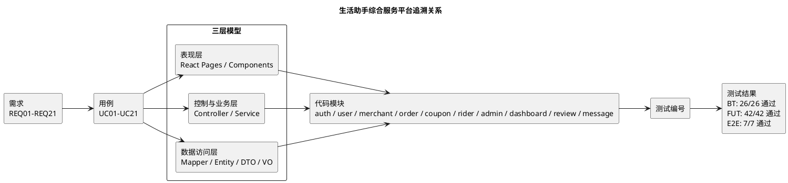

# 需求追溯表

生成日期：2026-08-26

本文档将需求、用例、三层模型、代码模块、测试编号和测试结果放在同一套追溯矩阵中。需求编号与用例编号沿用 `backend/软件需求规格说明书.md` 中的 REQ01-REQ21、UC01-UC21；设计模块参考 `backend/软件概要设计说明书.md` 的用例追踪矩阵；测试结果来自本次实际执行。

## 1 追溯关系总览

<!-- plantuml-image: 01-1-追溯关系总览 -->

## 2 本次完整测试结果摘要

| 测试集 | 命令 | 执行结果 | 备注 |
| --- | --- | --- | --- |
| 后端 JUnit/MockMvc | 在 `backend` 目录执行：`.\\gradlew.bat --gradle-user-home D:\\Develop\\gradle-home --no-daemon test` | 通过，26/26 | 沙箱内 Gradle 缓存权限/插件解析受限，已在沙箱外复用本机 Gradle 缓存执行成功。 |
| 前端 Vitest | `frontend/npm test -- --reporter=verbose` | 通过，42/42 | 运行中出现 React Router v7 future flag 警告，不影响测试结果。 |
| 前端 Playwright E2E | `frontend/npm run e2e` | 通过，7/7 | 沙箱内 Chromium 启动被拒绝，已在沙箱外执行成功。 |

## 3 需求-用例-模型-代码-测试追溯矩阵

| 需求 | 用例 | 三层模型 | 代码模块 | 测试编号 | 测试结果 |
| --- | --- | --- | --- | --- | --- |
| REQ01 多角色注册/登录进入对应工作区 | UC01 多角色注册、登录与会话建立 | 表现层：`Login.jsx`、`ApiProvider.jsx`；业务层：`AuthController`、`AuthService`、`JwtAuthInterceptor`；数据层：`User/Merchant/Rider/Admin`、对应 Mapper | `frontend/src/pages/Login.jsx`；`frontend/src/utils/ApiProvider.jsx`；`backend/src/main/java/com/example/demo/auth`；`backend/src/main/java/com/example/demo/common/Jwt*.java` | E2E01、E2E07、FUT14-FUT17、BT06、BT22 | 通过 |
| REQ02 浏览、筛选商家和商品 | UC02 游客/用户发现商家与商品 | 表现层：`Home.jsx`、`Search.jsx`、`MerchantDetail.jsx`；业务层：`MerchantController`、`SearchController`、`MerchantService`、`SearchService`；数据层：`Merchant/Product/Category/ProductSpec` | `frontend/src/pages/Home.jsx`；`frontend/src/pages/Search.jsx`；`frontend/src/pages/MerchantDetail.jsx`；`backend/src/main/java/com/example/demo/merchant`；`backend/src/main/java/com/example/demo/search` | E2E02、E2E06、FUT12-FUT13、FUT22-FUT24、FUT40-FUT42、BT23 | 通过 |
| REQ03 获得推荐商家 | UC03 基于位置/评分/销量获得推荐商家 | 表现层：消费者首页/下单闭环场景；业务层：`RecommendController`、`RecommendService`；数据层：`Merchant/Product` | `backend/src/main/java/com/example/demo/recommend`；`frontend/src/pages/Home.jsx` | E2E02、BT23 | 通过 |
| REQ04 维护个人资料和收货地址 | UC04 消费者维护个人资料和收货地址 | 表现层：`Profile.jsx`；业务层：`UserController`、`UserService`；数据层：`User/Address/UserFavoriteMerchant` | `frontend/src/pages/Profile.jsx`；`backend/src/main/java/com/example/demo/user` | E2E02、FUT32-FUT35、BT09、BT11 | 通过 |
| REQ05 管理购物车形成结算清单 | UC05 消费者管理购物车并形成结算清单 | 表现层：`MerchantDetail.jsx`、`Cart.jsx`、`Checkout.jsx`；业务层：`UserController`、`UserService`；数据层：`Cart/Product/ProductSpec` | `frontend/src/pages/Cart.jsx`；`frontend/src/pages/MerchantDetail.jsx`；`frontend/src/pages/Checkout.jsx`；`backend/src/main/java/com/example/demo/user`；`backend/src/main/java/com/example/demo/merchant` | E2E02、FUT05-FUT08、FUT23、BT12 | 通过 |
| REQ06 领取并使用优惠券 | UC06 消费者领取并在订单中使用优惠券 | 表现层：`Coupons.jsx`、`Checkout.jsx`；业务层：`CouponController`、`CouponService`、`OrderService`；数据层：`Coupon/UserCoupon/Orders` | `frontend/src/pages/Coupons.jsx`；`frontend/src/pages/Checkout.jsx`；`backend/src/main/java/com/example/demo/coupon`；`backend/src/main/java/com/example/demo/order` | E2E02、FUT09-FUT10、BT14、BT18、BT21、BT24 | 通过 |
| REQ07 提交外卖订单 | UC07 消费者提交外卖订单 | 表现层：`Checkout.jsx`；业务层：`OrderController`、`OrderService`；数据层：`Orders/OrderItem/ProductSpec/Cart` | `frontend/src/pages/Checkout.jsx`；`backend/src/main/java/com/example/demo/order`；`backend/src/main/java/com/example/demo/merchant` | E2E02、FUT09-FUT11、BT08、BT15、BT24 | 通过 |
| REQ08 支付待支付订单 | UC08 消费者支付待支付订单 | 表现层：`Checkout.jsx`、`Orders.jsx`；业务层：`PaymentController`、`PaymentService`、`OrderService`；数据层：`Payment/Orders` | `frontend/src/pages/Checkout.jsx`；`frontend/src/pages/Orders.jsx`；`backend/src/main/java/com/example/demo/payment`；`backend/src/main/java/com/example/demo/order` | E2E02、FUT10、FUT28、FUT31、BT10、BT24 | 通过 |
| REQ09 取消未履约订单 | UC09 消费者取消未完成订单 | 表现层：`Orders.jsx`；业务层：`OrderController`、`OrderService`、`CouponService`；数据层：`Orders/OrderItem/ProductSpec/UserCoupon` | `frontend/src/pages/Orders.jsx`；`backend/src/main/java/com/example/demo/order`；`backend/src/main/java/com/example/demo/coupon` | E2E02、FUT29、BT15、BT18 | 通过 |
| REQ10 查看配送并确认收货 | UC10 消费者追踪配送并确认收货 | 表现层：`Delivery.jsx`、`Orders.jsx`、`RiderConsole.jsx`；业务层：`DeliveryController`、`DeliveryService`、`OrderController`、`RiderService`；数据层：`Orders/Rider/Payment/UserCoupon` | `frontend/src/pages/Delivery.jsx`；`frontend/src/pages/Orders.jsx`；`frontend/src/pages/RiderConsole.jsx`；`backend/src/main/java/com/example/demo/delivery`；`backend/src/main/java/com/example/demo/rider`；`backend/src/main/java/com/example/demo/order` | E2E02、E2E04、FUT30、FUT36-FUT38、BT17、BT21、BT24 | 通过 |
| REQ11 评价已完成订单 | UC11 消费者评价已完成订单 | 表现层：`Review.jsx`、`ReviewImageGallery.jsx`、商家/详情评价入口；业务层：`ReviewController`、`ReviewService`；数据层：`Review/OrderItem/Orders` | `frontend/src/pages/Review.jsx`；`frontend/src/components/ReviewImageGallery.jsx`；`backend/src/main/java/com/example/demo/review` | E2E02、E2E03、FUT18、FUT22、BT05 | 通过 |
| REQ12 商家注册/登录进入经营后台 | UC12 商家注册/启用并进入经营后台 | 表现层：`Login.jsx`、`MerchantConsole.jsx`；业务层：`AuthController`、`AuthService`；数据层：`Merchant/Admin` | `frontend/src/pages/Login.jsx`；`frontend/src/pages/MerchantConsole.jsx`；`backend/src/main/java/com/example/demo/auth`；`backend/src/main/java/com/example/demo/merchant` | E2E01、FUT14-FUT17、BT22 | 通过 |
| REQ13 商家维护店铺资料 | UC13 商家维护店铺资料 | 表现层：`MerchantConsole.jsx`；业务层：`MerchantController`、`MerchantService`；数据层：`Merchant` | `frontend/src/pages/MerchantConsole.jsx`；`backend/src/main/java/com/example/demo/merchant` | E2E03、FUT18-FUT19、BT26 | 通过 |
| REQ14 商家维护商品、规格和库存 | UC14 商家管理商品、规格与库存 | 表现层：`MerchantConsole.jsx`；业务层：`MerchantController`、`MerchantService`；数据层：`Product/Category/SpecGroup/ProductSpec` | `frontend/src/pages/MerchantConsole.jsx`；`backend/src/main/java/com/example/demo/merchant` | E2E03、FUT20、BT25 | 通过 |
| REQ15 商家处理本店订单 | UC15 商家处理本店订单 | 表现层：`MerchantConsole.jsx`；业务层：`MerchantOrderController`、`OrderService`；数据层：`Orders/OrderItem` | `frontend/src/pages/MerchantConsole.jsx`；`backend/src/main/java/com/example/demo/order` | E2E03、FUT21、BT13 | 通过 |
| REQ16 骑手接单并完成配送 | UC16 骑手接单并完成配送 | 表现层：`RiderConsole.jsx`；业务层：`RiderController`、`RiderService`、`OrderService`、`CouponService`；数据层：`Rider/Orders/UserCoupon` | `frontend/src/pages/RiderConsole.jsx`；`backend/src/main/java/com/example/demo/rider`；`backend/src/main/java/com/example/demo/order`；`backend/src/main/java/com/example/demo/coupon` | E2E04、FUT36-FUT38、BT07、BT21、BT24 | 通过 |
| REQ17 骑手维护资料 | UC17 骑手维护个人资料 | 表现层：`RiderConsole.jsx`；业务层：`RiderController`、`RiderService`；数据层：`Rider` | `frontend/src/pages/RiderConsole.jsx`；`backend/src/main/java/com/example/demo/rider` | E2E04、FUT39、BT07 | 通过 |
| REQ18 管理员管理用户/商家/骑手状态 | UC18 管理员管理用户/商家/骑手状态 | 表现层：`AdminConsole.jsx`；业务层：`AdminController`、`AdminService`、`AuthService`；数据层：`User/Merchant/Rider/Admin` | `frontend/src/pages/AdminConsole.jsx`；`backend/src/main/java/com/example/demo/admin`；`backend/src/main/java/com/example/demo/auth` | E2E05、FUT01-FUT03、BT02、BT04、BT22 | 通过 |
| REQ19 管理员查看平台订单 | UC19 管理员查看平台订单 | 表现层：`AdminConsole.jsx`；业务层：`AdminController`、`AdminService`；数据层：`Orders/OrderItem` | `frontend/src/pages/AdminConsole.jsx`；`backend/src/main/java/com/example/demo/admin`；`backend/src/main/java/com/example/demo/order` | E2E05、FUT04、BT02 | 通过 |
| REQ20 多角色查看看板统计 | UC20 多角色查看运营看板 | 表现层：`MerchantConsole.jsx`、`RiderConsole.jsx`、`AdminConsole.jsx`；业务层：`DashboardController`、`DashboardService`；数据层：`Orders/Payment/Review/UserFavoriteMerchant/Rider` | `frontend/src/pages/MerchantConsole.jsx`；`frontend/src/pages/RiderConsole.jsx`；`frontend/src/pages/AdminConsole.jsx`；`backend/src/main/java/com/example/demo/dashboard` | E2E02、E2E03、E2E04、FUT01、FUT18、FUT36、BT16、BT19 | 通过 |
| REQ21 围绕订单发送文字消息 | UC21 角色间订单会话沟通 | 表现层：`Messages.jsx`、`MessageOrderDetail.jsx`；业务层：`MessageController`、`MessageService`；数据层：`Message/Orders` | `frontend/src/pages/Messages.jsx`；`frontend/src/pages/MessageOrderDetail.jsx`；`backend/src/main/java/com/example/demo/message` | E2E02、FUT25-FUT27、BT01、BT03 | 通过 |

## 4 后端测试编号与结果

| 编号 | 测试类 | 测试方法 | 结果 |
| --- | --- | --- | --- |
| BT01 | `AdminAndMessageApiTests` | `messageConversationTracksUnreadCountsAndMarksMessagesRead()` | PASSED |
| BT02 | `AdminAndMessageApiTests` | `adminCanAuditPendingMerchantAndRiderAndQueryOrders()` | PASSED |
| BT03 | `AdminAndMessageApiTests` | `messageApiRejectsBlankContentAndUnrelatedOrderParticipant()` | PASSED |
| BT04 | `AdminAndMessageApiTests` | `adminEndpointsRequireAdminRoleAndCanManageSubjectStatus()` | PASSED |
| BT05 | `AuthOrderReviewRiderApiTests` | `reviewApiRejectsIncompleteInvalidAndDuplicateReviews()` | PASSED |
| BT06 | `AuthOrderReviewRiderApiTests` | `authApiRejectsDuplicateRegistrationWrongPasswordAndFrozenLogin()` | PASSED |
| BT07 | `AuthOrderReviewRiderApiTests` | `riderApiRejectsDuplicatePhoneAndOtherRiderTaskCompletion()` | PASSED |
| BT08 | `AuthOrderReviewRiderApiTests` | `checkoutApiRejectsInvalidAddressMerchantProductAndSpec()` | PASSED |
| BT09 | `ConsumerApiTests` | `profileUpdateRejectsDuplicatePhone()` | PASSED |
| BT10 | `ConsumerApiTests` | `paymentRejectsOtherUsersOrderAndInvalidOrderStatus()` | PASSED |
| BT11 | `ConsumerApiTests` | `addressCrudKeepsOwnershipAndSingleDefaultAddress()` | PASSED |
| BT12 | `ConsumerApiTests` | `cartApiAddsUpdatesDeletesAndRejectsMissingProduct()` | PASSED |
| BT13 | `DemoApplicationTests` | `merchantApiAcceptsChineseStatusValue()` | PASSED |
| BT14 | `DemoApplicationTests` | `claimCouponRejectsEmptyInventoryAndNullLimit()` | PASSED |
| BT15 | `DemoApplicationTests` | `checkoutReservesInventoryAndCancelRestoresIt()` | PASSED |
| BT16 | `DemoApplicationTests` | `dashboardMetricsUseCompletedAtDeliveryFeeAndRiderStatus()` | PASSED |
| BT17 | `DemoApplicationTests` | `deliveryInfoRequiresOrderOwner()` | PASSED |
| BT18 | `DemoApplicationTests` | `releaseCouponClearsOrderBinding()` | PASSED |
| BT19 | `DemoApplicationTests` | `favoriteMerchantApiIsIdempotentAndDashboardCountsOnlyActiveFavorites()` | PASSED |
| BT20 | `DemoApplicationTests` | `authenticatedUsersCanUploadImagesForProfilesAndProducts()` | PASSED |
| BT21 | `DemoApplicationTests` | `riderCompletionMarksLockedCouponAsUsed()` | PASSED |
| BT22 | `DemoApplicationTests` | `merchantAndRiderRegistrationCanLoginButRequiresAdminAuditForCoreFeatures()` | PASSED |
| BT23 | `DemoApplicationTests` | `searchAndRecommendOnlyExposeActiveMerchantsWithExpectedKeywordMatches()` | PASSED |
| BT24 | `DemoApplicationTests` | `fullConsumerRiderFlowWorksEndToEnd()` | PASSED |
| BT25 | `MerchantApiTests` | `merchantProductApiAddsUpdatesRejectsCrossStoreMutationAndDeletes()` | PASSED |
| BT26 | `MerchantApiTests` | `merchantProfileUpdatePreservesSensitiveMetricsAndRequiresMerchantRole()` | PASSED |

## 5 前端单元测试编号与结果

| 编号 | 测试文件 | 测试项 | 结果 |
| --- | --- | --- | --- |
| FUT01 | `AdminConsole.test.jsx` | loads platform management totals and user table | PASSED |
| FUT02 | `AdminConsole.test.jsx` | freezes an active user and reloads management data | PASSED |
| FUT03 | `AdminConsole.test.jsx` | approves a pending merchant from the merchant tab | PASSED |
| FUT04 | `AdminConsole.test.jsx` | shows platform orders in the order tab | PASSED |
| FUT05 | `Cart.test.jsx` | loads cart items and grouped merchant summary | PASSED |
| FUT06 | `Cart.test.jsx` | updates item quantity and reloads cart data | PASSED |
| FUT07 | `Cart.test.jsx` | removes a cart item | PASSED |
| FUT08 | `Cart.test.jsx` | clears the cart and shows a success notice | PASSED |
| FUT09 | `Checkout.test.jsx` | loads cart, address, coupon, and merchant delivery fee for checkout | PASSED |
| FUT10 | `Checkout.test.jsx` | submits checkout data and pays the created order | PASSED |
| FUT11 | `Checkout.test.jsx` | warns when no delivery address is available | PASSED |
| FUT12 | `Home.test.jsx` | loads categories and merchant cards from the public API | PASSED |
| FUT13 | `Home.test.jsx` | navigates to Search with keyword and category query params | PASSED |
| FUT14 | `Login.test.jsx` | renders the login form and role selector | PASSED |
| FUT15 | `Login.test.jsx` | updates the role-specific hint when selecting merchant | PASSED |
| FUT16 | `Login.test.jsx` | submits login credentials with captcha data | PASSED |
| FUT17 | `Login.test.jsx` | shows an error notice when login fails | PASSED |
| FUT18 | `MerchantConsole.test.jsx` | loads merchant dashboard metrics, profile, and recent reviews | PASSED |
| FUT19 | `MerchantConsole.test.jsx` | saves merchant profile changes with numeric delivery fields | PASSED |
| FUT20 | `MerchantConsole.test.jsx` | creates a product from the product management tab | PASSED |
| FUT21 | `MerchantConsole.test.jsx` | marks a delivering order as completed | PASSED |
| FUT22 | `MerchantDetail.test.jsx` | loads merchant detail, products, favorite state, and reviews | PASSED |
| FUT23 | `MerchantDetail.test.jsx` | adds a product to cart with the selected single spec label | PASSED |
| FUT24 | `MerchantDetail.test.jsx` | favorites the merchant for an authenticated consumer | PASSED |
| FUT25 | `Messages.test.jsx` | loads threads and selected order messages from URL params | PASSED |
| FUT26 | `Messages.test.jsx` | opens a thread from the thread list and loads its messages | PASSED |
| FUT27 | `Messages.test.jsx` | sends a message in the selected order conversation and refreshes data | PASSED |
| FUT28 | `Orders.test.jsx` | loads orders and pays a pending payment order | PASSED |
| FUT29 | `Orders.test.jsx` | cancels a cancelable order | PASSED |
| FUT30 | `Orders.test.jsx` | completes a delivering order | PASSED |
| FUT31 | `Orders.test.jsx` | loads and displays payment records | PASSED |
| FUT32 | `Profile.test.jsx` | loads profile, addresses, and favorite merchants | PASSED |
| FUT33 | `Profile.test.jsx` | saves profile changes and updates the current session user | PASSED |
| FUT34 | `Profile.test.jsx` | adds a new default address | PASSED |
| FUT35 | `Profile.test.jsx` | removes a favorite merchant from the list | PASSED |
| FUT36 | `RiderConsole.test.jsx` | loads rider metrics, profile, and task lists | PASSED |
| FUT37 | `RiderConsole.test.jsx` | accepts an available delivery task | PASSED |
| FUT38 | `RiderConsole.test.jsx` | completes an assigned delivery task | PASSED |
| FUT39 | `RiderConsole.test.jsx` | saves rider profile changes and updates session user | PASSED |
| FUT40 | `Search.test.jsx` | calls search API with keyword, category, and sort from the URL | PASSED |
| FUT41 | `Search.test.jsx` | updates search params from user input before reloading results | PASSED |
| FUT42 | `Search.test.jsx` | shows an empty state when no active merchant matches the query | PASSED |

## 6 前端端到端测试编号与结果

| 编号 | 测试文件 | 场景 | 结果 |
| --- | --- | --- | --- |
| E2E01 | `business-scenarios.spec.js` | UC01 UC12 多角色注册、登录与会话分流 | PASSED |
| E2E02 | `business-scenarios.spec.js` | UC02 UC03 UC04 UC05 UC06 UC07 UC08 UC09 UC10 UC11 UC20 UC21 消费者下单闭环 | PASSED |
| E2E03 | `business-scenarios.spec.js` | UC13 UC14 UC15 UC20 商家资料、商品、订单和评价入口 | PASSED |
| E2E04 | `business-scenarios.spec.js` | UC16 UC17 UC20 骑手资料、接单与完成配送 | PASSED |
| E2E05 | `business-scenarios.spec.js` | UC18 UC19 管理员主体状态管理与平台订单查看 | PASSED |
| E2E06 | `home-search.spec.js` | consumer can search merchants from the home page | PASSED |
| E2E07 | `login.spec.js` | consumer can log in and persist session data | PASSED |

